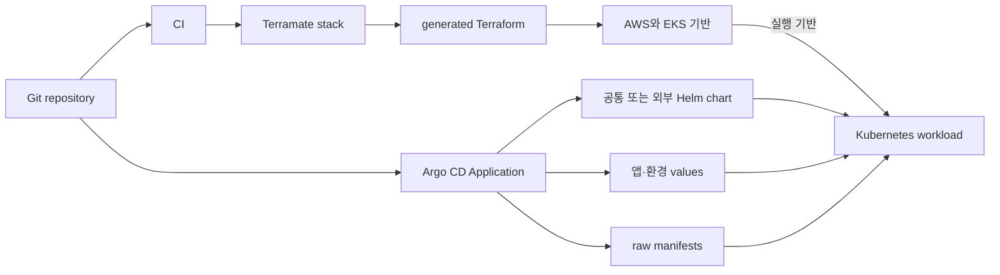
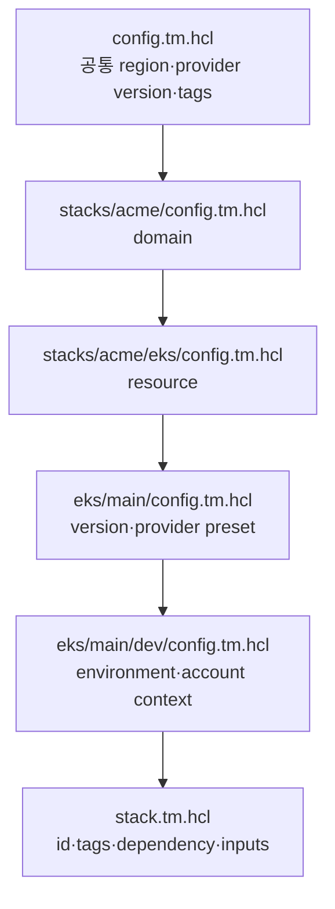
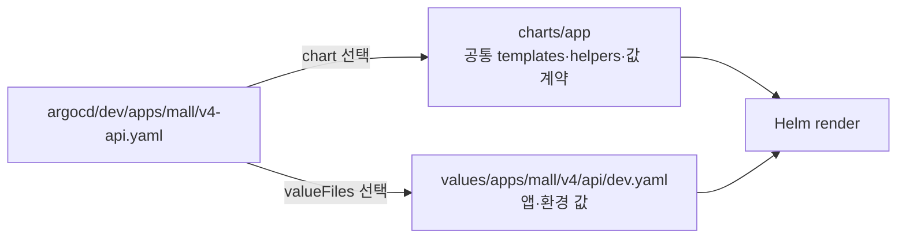

# GitOps 저장소 아키텍처와 공통화 설계

이 문서는 입사 시점의 Terraform 저장소와, 분리되어 있던 Kubernetes manifest 저장소가 현재의 GitOps 모노레포로 수렴한 설계 흐름과, 인프라·애플리케이션 배포 설정을 어떻게 나누고 다시 조합하는지 설명한다. 고정된 코드 스냅샷의 구조를 비교하며, 해당 리소스의 현재 실행 상태를 증명하는 문서는 아니다.

| 구분 | 저장소 | 담당 영역 | 기준 스냅샷 |
|---|---|---|---|
| 입사 시점 | [`infra-config-portfolio`](https://github.com/b100to/infra-config-portfolio) | Terraform — ECS·RDS·network, Terraform Cloud 실행 | [`83a3c40`](https://github.com/b100to/infra-config-portfolio/tree/83a3c408fb7be3917c0f2efba3d137f54c0fa205) |
| 개편 전 | [`manifest-k8s-cluster-portfolio`](https://github.com/b100to/manifest-k8s-cluster-portfolio) | EKS 서비스별 Helm chart·raw manifest | [`ed4f0a3`](https://github.com/b100to/manifest-k8s-cluster-portfolio/tree/ed4f0a3891a8bc075ed54113d2fdaebf25f58fcb) |
| 현재 | [`devops-configs-portfolio`](https://github.com/b100to/devops-configs-portfolio) | 인프라와 배포 선언을 묶은 모노레포 | [`7e3427a`](https://github.com/b100to/devops-configs-portfolio/tree/7e3427a3a422f103cc6e4bc12adf79147ddacbec) |

## 1. 두 갈래의 이전 저장소에서 GitOps 모노레포로

현재 모노레포는 두 저장소의 후신이다. 인프라 쪽은 ECS 시절의 Terraform 저장소에서, 배포 쪽은 EKS 서비스별 manifest 저장소에서 왔다. 두 저장소는 Terraform용과 manifest용으로 나란히 운영되었고, 입사 후 약 2년간 그 구조를 쓴 뒤 하나로 개편했다.

```text
infra-config           Terraform · ECS · Terraform Cloud   ─┐
                                                            ├─▶ devops-configs (GitOps 모노레포)
manifest-k8s-cluster   서비스별 Helm · raw · Kustomize      ─┘
```

입사 시점 저장소의 [`README.md`](https://github.com/b100to/infra-config-portfolio/blob/83a3c408fb7be3917c0f2efba3d137f54c0fa205/README.md)는 “현재는 terraform 코드만 있지만, 향후 Kubernetes와 관련된 선언형 설정 코드들이 이 저장소에 추가될 수 있습니다”라고 적고 있다. 현재 구조는 그 방향을 역할별 폴더로 구체화한 결과다.

### 1-1. 인프라 쪽: 입사 시점의 Terraform 저장소

하나의 `terraform/` 아래에 세 가지 경로 규칙이 공존했다.

```text
terraform/
├── network/{dev,prod}/          # <resource>/<env>        환경별 디렉터리 복제
├── security/{dev,prod}/
├── {dev,stage,prod}/common/     # <env>/common/<resource> 환경이 최상위
│   └── alb/ ecr/ ecs/ s3/
├── hospital/<service>/          # <product>/<service>     환경 디렉터리 없음
├── mall/{back,front}/
└── modules/ecs/{single_task,multi_task,v2-ecs,rabbitmq}/
```

세 번째 규칙에서는 환경이 경로에 없다. Terraform Cloud workspace 이름에서 환경을 뽑아내고, 환경별 값은 `locals`의 map으로 들고 있다. [`hospital/back-v2`](https://github.com/b100to/infra-config-portfolio/tree/83a3c408fb7be3917c0f2efba3d137f54c0fa205/terraform/hospital/back-v2)의 관련 필드 발췌:

```hcl
# version.tf
backend "remote" {
  organization = "acme"
  workspaces { prefix = "hospital-back-v2-" }
}

# local.tf
env        = regex(join("|", values(var.environment)), terraform.workspace)
cpu        = { dev = 512, stage = 512, prod = 512 }
remote_env = { dev = "dev", stage = "prod", prod = "prod" } # stage 전용 network·security 가 없어 prod 를 참조
```

즉 “이 stack의 환경이 무엇인가”의 답이 디렉터리 이름, 최상위 폴더, workspace 이름 중 어디에 있는지가 stack마다 달랐다.

| 관점 | 입사 시점 (`infra-config`) | 현재 (`devops-configs`) |
|---|---|---|
| 워크로드 런타임 | ECS Fargate. task definition과 컨테이너 command까지 Terraform이 소유 ([`backend.tf`](https://github.com/b100to/infra-config-portfolio/blob/83a3c408fb7be3917c0f2efba3d137f54c0fa205/terraform/dev/common/ecs/backend.tf)) | EKS. Terraform은 플랫폼까지, workload는 Helm values와 Argo CD |
| 실행과 state | Terraform Cloud VCS-driven, workspace별 state | GitHub Actions + S3 backend, `--changed`로 대상 stack 선택 |
| 브랜치 모델 | `dev`·`stage`·`prod` 환경 브랜치, push마다 Terraform Cloud 트리거 | `main` + feature 브랜치, 환경은 stack tag로 선택 |
| backend 선언 | 디렉터리마다 직접 쓴 `backend "remote"` 39개 | [`imports/backend.tm.hcl`](https://github.com/b100to/devops-configs-portfolio/blob/7e3427a3a422f103cc6e4bc12adf79147ddacbec/imports/backend.tm.hcl) 생성 규칙 1개로 69개 stack의 S3 backend 관리 |
| 버전 고정 | 디렉터리별 선언. Terraform 제약 5종, AWS provider 제약 7종(major 3·4 공존) | 루트 [`config.tm.hcl`](https://github.com/b100to/devops-configs-portfolio/blob/7e3427a3a422f103cc6e4bc12adf79147ddacbec/config.tm.hcl)의 globals 한 곳 |
| 환경 차이 표현 | 디렉터리 복제 또는 `locals`의 환경 키 map. `network/dev/main.tf`와 `network/prod/main.tf`는 158줄 중 `Environment` 태그 1줄만 다름 | leaf에는 `stack.tm.hcl`·`tfvars.tm.hcl` 등 차이만 두고 나머지는 생성 |
| stack 간 값 전달 | `terraform_remote_state` 59곳이 workspace 이름 문자열을 참조 | `input` 블록 86개가 stack ID를 참조. `terraform_remote_state`는 0 |
| CI 자격 증명 | workspace 환경 변수에 IAM user access key ([`terraform.md`](https://github.com/b100to/infra-config-portfolio/blob/83a3c408fb7be3917c0f2efba3d137f54c0fa205/terraform/terraform.md)) | GitHub OIDC로 role assume ([`_bootstrap/oidc_aws_github`](https://github.com/b100to/devops-configs-portfolio/tree/7e3427a3a422f103cc6e4bc12adf79147ddacbec/_bootstrap/oidc_aws_github)) |

수치는 두 스냅샷의 선언을 집계한 값이다. 입사 시점의 remote backend는 실험용 `terraform/test/`를 제외하면 39개, 포함하면 44개다. 현재 전체 75개 stack 중 69개에는 S3 backend, `_bootstrap` 4개에는 local backend가 있고, pod-identity-agent/kubecost의 dev·prd 2개에는 backend 파일이 없다. 3절의 경로 축, 4절의 생성 규칙과 값 공유는 각각 이 표의 행 하나에 대한 현재의 답이다.

### 1-2. 배포 쪽: Kubernetes manifest 분리 저장소

개편 전에는 Kubernetes 배포 구성이 별도 저장소에 있었다. 현재 구조는 Terraform/Terramate 인프라, Argo CD Application, Helm chart와 values, raw manifest를 하나의 GitOps 모노레포 안에서 역할별로 재배치한다.

이 변화는 Helm이나 Argo CD를 새로 도입한 것이 아니다. 이전 저장소의 [`acmemall-backend-v4/README.md`](https://github.com/b100to/manifest-k8s-cluster-portfolio/blob/ed4f0a3891a8bc075ed54113d2fdaebf25f58fcb/acmemall-backend-v4/README.md)에도 Argo CD 기반 흐름이 명시되어 있고, 서비스별 Helm chart와 raw manifest·Kustomize 구성이 함께 존재한다. 개편의 중심은 도구 교체보다 저장소 경계와 공통화 단위를 다시 설계한 데 있다.

| 관점 | 개편 전 | 현재 |
|---|---|---|
| 저장소 경계 | Kubernetes manifest 전용 분리 저장소 | 인프라와 배포 선언을 묶은 GitOps 모노레포 |
| 루트 구조 | 서비스 이름이 최상위 경계를 형성 | `stacks`, `modules`, `charts`, `values`, `argocd`, `manifests` 등 역할별 폴더 |
| Helm chart | `api`, `api-admin` 등 서비스 하위에 chart 배치 | 여러 앱이 `charts/app` 공통 chart를 사용 |
| 환경 values | 서비스 chart 옆 `values/dev.yaml` 등 | `values/apps/<group>/<version>/<role>/<env>.yaml` 축으로 분리 |
| 배포 연결 | 서비스 로컬 Helmfile, Argo CD, raw/Kustomize 구성이 공존 | 커밋된 Application이 chart·values 또는 manifest를 명시적으로 연결 |

개편 전 구조에서는 서비스 디렉터리가 배포 단위와 공통화 경계를 함께 나타냈다.

```text
acmemall-backend-v4/
├── api/
│   ├── helm/          # API 전용 chart와 templates
│   ├── values/        # dev/prod/stage values
│   └── helmfile.yaml  # 서비스 로컬 chart·values 연결
├── api-admin/
│   ├── helm/
│   └── values/
└── api-notification/
    ├── helm/
    └── values/
```

예를 들어 [`api/helmfile.yaml`](https://github.com/b100to/manifest-k8s-cluster-portfolio/blob/ed4f0a3891a8bc075ed54113d2fdaebf25f58fcb/acmemall-backend-v4/api/helmfile.yaml)은 `./helm`과 `./values/{{.Environment.Name}}.yaml`을 연결한다. API와 API Admin은 각각 자신의 [`Chart.yaml`](https://github.com/b100to/manifest-k8s-cluster-portfolio/blob/ed4f0a3891a8bc075ed54113d2fdaebf25f58fcb/acmemall-backend-v4/api/helm/Chart.yaml)과 template 디렉터리를 가진다.

동시에 모든 서비스가 Helm으로 통일된 구조도 아니었다. [`acme-recommendation-api/dev/kustomization.yml`](https://github.com/b100to/manifest-k8s-cluster-portfolio/blob/ed4f0a3891a8bc075ed54113d2fdaebf25f58fcb/acme-recommendation-api/dev/kustomization.yml)은 같은 환경 폴더의 Namespace, Deployment, Service를 Kustomize resource로 조합한다.

현재 구조는 서비스별 설정을 없애기보다 위치와 책임을 분리한다. 공통 workload 골격은 `charts/app`, 서비스·환경 차이는 `values/apps`, 배포 연결은 `argocd`, 클라우드 기반은 `stacks`와 `modules`가 맡는다. 이후 절에서는 이 현재 구조를 각 계층별로 설명한다.

### 1-3. 두 저장소를 하나로 합친 이유

분리는 그 자체로 비용이다. 이 규모에서는 그 비용을 정당화할 이점이 없다고 판단했다.

| 이유 | 설명 |
|---|---|
| 하나의 개념이 두 저장소에 걸친다 | 인프라와 배포는 이름으로 이어져 있다. 저장소가 나뉘면 그 연결이 PR 두 개와 맞춰야 할 순서로 바뀐다 |
| LLM 보조 작업 | 저장소별로 나뉜 작업 맥락에서 연결을 추적하려면 다른 저장소를 추가로 탐색해야 했다. 통합해 탐색과 변경 검토를 한 작업 맥락·PR에 모았다 |
| 코드 규모 | 저장소 분리의 이점(독립 권한, 독립 릴리스 주기)은 규모가 클 때 나온다. 한 팀이 관리하는 규모에서는 오가는 비용만 남는다 |

첫 번째 이유의 예가 컨테이너 이미지 저장소 이름이다. 현재 저장소에서는 같은 문자열이 두 계층에 나란히 있다.

```text
stacks/acme/ecr/mall/dev/main.tf        "acmemall-backend-v4/dev/api"              # ECR repository 생성
values/apps/mall/v4/api/dev.yaml        repository: acmemall-backend-v4/dev/api    # 그 이미지를 배포
```

[`ECR stack`](https://github.com/b100to/devops-configs-portfolio/blob/7e3427a3a422f103cc6e4bc12adf79147ddacbec/stacks/acme/ecr/mall/dev/main.tf)과 [`앱 values`](https://github.com/b100to/devops-configs-portfolio/blob/7e3427a3a422f103cc6e4bc12adf79147ddacbec/values/apps/mall/v4/api/dev.yaml)가 한 저장소에 있으므로 한 번의 검색으로 양쪽이 나오고, 이름을 바꾸는 변경이 한 PR에 담긴다.

두 번째 이유는 저장소에 흔적이 남아 있다. 루트의 [`AGENTS.md`](https://github.com/b100to/devops-configs-portfolio/blob/7e3427a3a422f103cc6e4bc12adf79147ddacbec/AGENTS.md)는 “Terraform 적용 규칙”과 “ArgoCD/Helm 작업 규칙”을 한 파일에 담아, 인프라와 배포의 작업 규칙을 한곳에서 찾도록 한다.

반대급부는 권한과 변경 반경이 한 저장소로 모인다는 점이다. 실행 범위는 `--changed`와 환경 tag가 stack 단위로 좁힌다. 권한은 아직 좁히지 않았다. 이 스냅샷의 [`CODEOWNERS`](https://github.com/b100to/devops-configs-portfolio/blob/7e3427a3a422f103cc6e4bc12adf79147ddacbec/.github/CODEOWNERS)는 단일 소유자 규칙 하나이고, 팀이 커지면 경로별 소유자로 나누는 것이 저장소를 다시 쪼개는 것보다 먼저 쓸 수단이다.

## 2. 저장소를 역할로 읽기

최상위 폴더는 도구 이름보다 변경 책임을 드러낸다. Terraform/Terramate, Argo CD, Helm values, raw manifest가 서로 다른 변경 경계를 갖고 한 저장소 안에서 연결된다.

```text
devops-configs-portfolio/
├── _bootstrap/       # 원격 state와 CI 신뢰 기반을 먼저 만드는 스택
├── stacks/           # 환경별 Terraform 실행 단위
├── modules/          # Terramate generate_hcl 공통 모듈
├── imports/          # provider·backend 생성 규칙
├── charts/
│   ├── app/          # 일반 서비스용 공통 Helm 차트
│   └── batch/        # 별도 배치 차트(현재 주 경로는 아님)
├── values/
│   ├── apps/         # 애플리케이션·환경별 값
│   └── infra/        # 외부 인프라 차트의 값
├── argocd/           # Argo CD Application 선언
└── manifests/        # 차트 밖의 raw Kubernetes 리소스
```

이 구조에는 크게 두 흐름이 있다.



첫 번째 흐름은 Terraform이 클라우드·클러스터 기반과 일부 bootstrap 구성요소를 만든다. 두 번째 흐름은 Argo CD가 공통 차트, 외부 차트, raw manifest를 원하는 Kubernetes 리소스로 연결한다. 소스: [루트 구조](https://github.com/b100to/devops-configs-portfolio/tree/7e3427a3a422f103cc6e4bc12adf79147ddacbec), [Terramate stacks](https://github.com/b100to/devops-configs-portfolio/tree/7e3427a3a422f103cc6e4bc12adf79147ddacbec/stacks), [Argo CD 선언](https://github.com/b100to/devops-configs-portfolio/tree/7e3427a3a422f103cc6e4bc12adf79147ddacbec/argocd)

## 3. 스택 경로가 표현하는 설계 축

대표적인 스택 경로는 다음처럼 읽는다.

```text
stacks/acme/eks/main/dev
       └─┬─┘ └┬┘ └┬┘ └┬┘
       domain kind target env

stacks/acme/ecr/mall/prd
       └─┬─┘ └┬┘ └┬┘ └┬┘
       domain kind group  env
```

| 축 | 의미 | EKS 예 | ECR 예 |
|---|---|---|---|
| `domain` | 조직 또는 플랫폼 경계 | `acme` | `acme` |
| resource kind | 관리 대상 종류 | `eks` | `ecr` |
| target / service group | 대상 클러스터나 서비스 묶음 | `main` | `mall` |
| environment | 격리된 배포 환경 | `dev` | `prd` |

입사 시점 저장소에서는 환경이 디렉터리, 최상위 폴더, workspace 이름 중 어디에 있는지가 stack마다 달랐다(1-1). 현재는 환경이 항상 leaf 디렉터리이고, 루트 [`config.tm.hcl`](https://github.com/b100to/devops-configs-portfolio/blob/7e3427a3a422f103cc6e4bc12adf79147ddacbec/config.tm.hcl)의 `environment = terramate.stack.path.basename` 한 줄이 그 규칙을 정의한다.

경로 깊이는 고정 스키마가 아니다. 예를 들어 `outline/prd`처럼 서비스 자체가 중간 축이 되거나, 리소스 종류에 따라 target 축이 생략될 수 있다. 따라서 “끝에서 두 번째는 항상 서비스” 같은 위치 기반 규칙보다 각 상위 `config.tm.hcl`이 정의하는 global을 함께 읽어야 한다.

EKS의 `main`은 버전 디렉터리가 아니다. [`stacks/acme/eks/main/config.tm.hcl`](https://github.com/b100to/devops-configs-portfolio/blob/7e3427a3a422f103cc6e4bc12adf79147ddacbec/stacks/acme/eks/main/config.tm.hcl)에서 `version = "v2"`를 별도 global로 정의한다. dev의 Kubernetes 버전 `1.35`도 [`tfvars.tm.hcl`](https://github.com/b100to/devops-configs-portfolio/blob/7e3427a3a422f103cc6e4bc12adf79147ddacbec/stacks/acme/eks/main/dev/tfvars.tm.hcl)에 따로 있다. 즉 `main`, `v2`, `1.35`는 각각 논리적 대상, 클러스터 세대, Kubernetes 버전이라는 다른 관심사다.

ECR은 같은 계층 규칙 안에서도 구현 선택이 다르다. [`stacks/acme/ecr/mall/prd/main.tf`](https://github.com/b100to/devops-configs-portfolio/blob/7e3427a3a422f103cc6e4bc12adf79147ddacbec/stacks/acme/ecr/mall/prd/main.tf)는 리포지터리와 lifecycle policy를 직접 작성한다. 모든 leaf stack이 공통 모듈에서 생성된다는 전제는 맞지 않는다.

## 4. Terramate 상속과 생성 경계

### Terraform Cloud와 환경 브랜치를 떠난 이유

도구를 고르기 전에 먼저 기존 실행 모델을 떠나야 할 이유가 셋 있었다.

| 문제 | 입사 시점의 모습 | 현재의 답 |
|---|---|---|
| 비용 | Terraform Cloud가 유료 요금제 대상이 되어 실행·state 보관만으로 비용이 추가됨 | S3 backend + GitHub Actions. 이미 쓰는 자원으로 대체 |
| 환경 브랜치 | `dev`·`stage`·`prod` 브랜치에 push하면 각각 트리거. 같은 변경을 세 브랜치에 맞춰 올려야 했고 배포 절차도 그만큼 길었음 | `main` 하나와 feature 브랜치. PR에서 plan, `main` merge에서 apply |
| workspace | 환경이 경로가 아니라 `terraform.workspace` 이름 안에 있어, 코드만 읽어서는 어느 환경에 적용되는지 알기 어려움(1-1) | 환경은 항상 leaf 디렉터리. `terraform.workspace` 참조는 0 |

환경 브랜치의 핵심 문제는 **환경 차이가 브랜치 간 diff로 표현된다**는 점이다. 브랜치가 어긋나면 그것이 의도한 환경 차이인지 아직 반영하지 않은 변경인지 구분할 수 없다. 현재 구조는 환경 차이를 한 브랜치 안의 디렉터리와 values 파일로 옮겨서, 어긋남이 생길 자리를 없앤다.

환경 선택은 브랜치 대신 stack tag가 맡는다. [`deploy.yml`](https://github.com/b100to/devops-configs-portfolio/blob/7e3427a3a422f103cc6e4bc12adf79147ddacbec/.github/workflows/deploy.yml)은 `main` push 하나로 시작해 `--tags=dev --changed`와 `--tags=prd --changed` job을 각각 돌리고, [`prewiew.yml`](https://github.com/b100to/devops-configs-portfolio/blob/7e3427a3a422f103cc6e4bc12adf79147ddacbec/.github/workflows/prewiew.yml)은 PR에서 같은 선택 규칙으로 plan을 보여준다.

### Terragrunt 대신 Terramate를 선택한 이유

가장 중요한 선택 기준은 **단순성과 전달 가능성**이었다. 인프라 코드는 작성자 혼자 보는 코드가 아니므로, 새로 합류한 사람도 폴더를 따라가며 공통 규칙과 stack별 차이를 빠르게 이해할 수 있어야 했다. Terramate는 Terraform/HCL과 비슷한 표현을 유지하고 생성 결과도 native `.tf`로 남긴다. 별도의 큰 추상화 체계를 익혀야 하는 부담이 작고, 최종 Terraform 구성을 직접 확인할 수 있다는 점을 높게 평가했다.

단순한 구조를 유지하면서도 `globals`, `import`, `generate_hcl`로 반복을 제거할 수 있다. 공통 규칙은 상위 디렉터리에 두고 환경별 차이만 leaf stack에 남기므로, stack이 늘어나도 같은 구조를 복제해 확장하기 쉽다. ECR처럼 필요한 곳에는 직접 작성한 `main.tf`를 함께 둘 수 있어 모든 리소스를 하나의 생성 방식으로 강제하지도 않는다.

Terragrunt도 `include`, `dependency`, remote state 구성과 run queue를 제공하는 유효한 대안이다. 다만 이 저장소에서는 wrapper 설정을 중심으로 실행을 구성하는 방식보다, 읽을 수 있는 Terraform 파일을 생성하고 Git 변경 단위로 stack을 선택하는 Terramate의 모델이 팀의 학습과 유지보수에 더 단순하다고 판단했다. [Gruntwork 공식 문서](https://docs.gruntwork.io/)와 [Terragrunt include 문서](https://github.com/gruntwork-io/terragrunt/blob/main/docs/src/content/docs/03-features/01-units/02-includes.mdx)에서 Terragrunt의 모델을 확인할 수 있다.

| 비교 관점 | Terramate를 선택한 이유 | Terragrunt의 중심 모델 |
|---|---|---|
| 팀의 이해 비용 | Terraform/HCL과 가까운 규칙과 생성된 `.tf`를 함께 확인 | `terragrunt.hcl`의 include·dependency 규칙을 이해 |
| DRY와 확장 | 상위 `globals`·`import`·`generate_hcl`을 상속하고 leaf에는 차이만 선언 | include와 module source 입력을 재사용 |
| 기존 코드와 공존 | 생성된 `.tf`와 직접 작성한 Terraform을 같은 stack에서 사용 | wrapper 설정이 Terraform/OpenTofu 실행을 둘러쌈 |
| 변경 실행 | Git-aware `--changed`와 tags로 CI 대상 stack 선택 | dependency graph 기반 run queue로 unit 실행 조정 |
| 운영 가시성 | Terramate Cloud에서 stack 상태와 drift·배포 이력을 조회 | 필요에 맞는 별도 플랫폼 또는 연동을 함께 선택 |

[`modules/eks/main.tm.hcl`](https://github.com/b100to/devops-configs-portfolio/blob/7e3427a3a422f103cc6e4bc12adf79147ddacbec/modules/eks/main.tm.hcl)의 `generate_hcl`은 module 호출을 native `.tf`로 만들고, provider와 backend도 leaf에 생성한다. GitHub Actions의 [`deploy.yml`](https://github.com/b100to/devops-configs-portfolio/blob/7e3427a3a422f103cc6e4bc12adf79147ddacbec/.github/workflows/deploy.yml)은 `--changed`와 환경 tag를 함께 사용해 plan/apply 대상을 고른다. 이 구조는 Terramate의 [code generation](https://terramate.io/docs/cli/code-generation/)과 [change detection](https://terramate.io/docs/cli/change-detection/)을 각각 코드 공통화와 배포 범위 계산에 사용한다.

Terramate Cloud도 선택을 뒷받침했다. UI에서 등록된 stack 수와 상태를 한눈에 보고, stack별 drift 결과와 배포 이력을 확인할 수 있어 저장소가 커져도 운영 상태를 추적하기 쉽다. 현재 Community 플랜은 무료로 제공되지만, 2명·1,000개 리소스·30일 데이터 보존 범위라는 제한이 있다. 자세한 기능과 제한은 [Terramate Cloud stack 문서](https://terramate.io/docs/cloud/stacks/details), [drift 문서](https://terramate.io/docs/cloud/drift/), [공식 요금표](https://terramate.io/pricing/)를 기준으로 한다.

선택 당시 지속적인 버전 업데이트와 빠른 제품 발전도 긍정적으로 평가했다. 이는 구조를 결정한 핵심 근거라기보다, 장기 운영에 사용할 도구라는 판단을 강화한 요소였다.

[`EKS dev stack`](https://github.com/b100to/devops-configs-portfolio/blob/7e3427a3a422f103cc6e4bc12adf79147ddacbec/stacks/acme/eks/main/dev/stack.tm.hcl)은 `after`와 `input`으로 실행 순서와 VPC output 전달을 각각 선언한다. 다만 Terramate 공식 문서에서 [outputs sharing](https://terramate.io/docs/cli/orchestration/outputs-sharing)은 experimental 기능으로 표시되며, 이 저장소의 workflow도 `--enable-sharing`을 명시한다. 이 기능은 도구 버전과 실험 기능 상태를 함께 관리해야 한다.

Terramate 설정은 루트에서 leaf 방향으로 맥락을 좁힌다.



| 구성 요소 | 책임 |
|---|---|
| Terramate `globals` | 디렉터리 계층에서 공유할 생성 시점 값과 규칙 |
| `import` | provider preset과 resource module의 생성 규칙 선택 |
| `stack.tm.hcl` | 실행 단위의 ID, 태그, 순서, 외부 입력 선언 |
| `tfvars.tm.hcl` | 해당 환경의 Terraform 변수 파일 생성 |
| Terraform `locals` | 생성된 Terraform 안에서 값을 조합 |
| Terraform `variables` | module 입력 계약과 기본값 정의 |

EKS target의 [`import.tm.hcl`](https://github.com/b100to/devops-configs-portfolio/blob/7e3427a3a422f103cc6e4bc12adf79147ddacbec/stacks/acme/eks/main/import.tm.hcl)은 provider 생성 규칙과 `/modules/eks/*.tm.hcl`을 가져온다. ECR에는 [`imports.tm.hcl`](https://github.com/b100to/devops-configs-portfolio/blob/7e3427a3a422f103cc6e4bc12adf79147ddacbec/stacks/acme/ecr/mall/imports.tm.hcl)처럼 복수형 파일명도 있다. 파일명 자체보다 Terramate의 `import` 블록이 무엇을 선택하는지가 핵심이다.

공통 EKS 모듈은 `generate_hcl`로 Terraform 파일을 만든다. [`modules/eks/main.tm.hcl`](https://github.com/b100to/devops-configs-portfolio/blob/7e3427a3a422f103cc6e4bc12adf79147ddacbec/modules/eks/main.tm.hcl)은 내부에서 `terraform-aws-modules/eks/aws`를 호출하고 허용할 버전 범위를 지정한다.

관련 필드 발췌:

```hcl
generate_hcl "_terramate_generated_main.tf" {
  content {
    module "eks" {
      source  = "terraform-aws-modules/eks/aws"
      version = "~> 21.9.0"
      # 입력은 locals와 variables에서 조합
    }
  }
}
```

`_terramate_generated_*.tf`와 `_generated_*.tf`는 생성 결과물이다. 소유권은 원본 `.tm.hcl`에 있으므로, 동작을 바꿀 때 생성 파일을 직접 고치는 대신 생성 규칙을 수정하고 다시 생성하는 구조다.
### 실행 순서와 값 공유는 별개다

[`EKS dev stack`](https://github.com/b100to/devops-configs-portfolio/blob/7e3427a3a422f103cc6e4bc12adf79147ddacbec/stacks/acme/eks/main/dev/stack.tm.hcl)은 두 관계를 함께 표현한다.

관련 필드 발췌:

```hcl
stack {
  after = ["tag:dev:vpc"]
}

input "vpc_id" {
  from_stack_id = "acme_vpc_main_dev"
  value         = outputs.vpc_id.value
}
```

`after`는 VPC 다음에 EKS를 실행하라는 순서 제약이다. `input`은 VPC stack output을 EKS input으로 전달하는 값 계약이다. 이 stack은 실행 순서와 값 전달을 각각 명시해 두 측면을 분리해서 표현한다.

입사 시점 저장소는 같은 값을 `terraform_remote_state`로 읽었다. 참조 키가 `"network-${local.remote_env[local.env]}"` 같은 workspace 이름 문자열이었고, 실행 순서는 코드에 선언되지 않았다. 현재는 참조 키가 stack ID이고 순서가 `after`로 남는다.

### backend는 환경과 stack ID를 분리한다

생성된 S3 backend는 환경마다 다른 bucket을 사용하고, stack ID의 구성 요소로 key를 만든다.

관련 필드 발췌:

```hcl
backend "s3" {
  bucket = "<environment-specific-state-bucket>"
  key    = "acme/eks/main/v2/dev/terraform.tfstate"
  profile = "dev"
}
```

입사 시점 저장소에서는 stack마다 `backend "remote"` 블록과 workspace 이름을 직접 썼다(1-1). 현재는 [`imports/backend.tm.hcl`](https://github.com/b100to/devops-configs-portfolio/blob/7e3427a3a422f103cc6e4bc12adf79147ddacbec/imports/backend.tm.hcl) 하나가 `global.domain`·`global.environment`로 bucket을, `terramate.stack.id`로 key를 조합한다.

EKS key에 경로에 없는 `v2`가 포함되는 점이 중요하다. 이는 단순한 폴더 경로 복사가 아니라 stack identity로부터 backend 주소를 구성한다는 뜻이다. 실제 생성 결과는 [`_terramate_generated_backend.tf`](https://github.com/b100to/devops-configs-portfolio/blob/7e3427a3a422f103cc6e4bc12adf79147ddacbec/stacks/acme/eks/main/dev/_terramate_generated_backend.tf)에서 확인할 수 있다.
## 5. 애플리케이션 공통 Helm 차트

[`charts/app`](https://github.com/b100to/devops-configs-portfolio/tree/7e3427a3a422f103cc6e4bc12adf79147ddacbec/charts/app)는 여러 서비스가 Kubernetes workload 골격을 공유하기 위한 차트다.

공통화 대상은 templates와 helpers다. 각 앱의 values가 생성 여부와 필요한 설정을 제공하고 template이 생략 가능한 값의 fallback을 처리한다. 공통 차트가 필요한 이유는 여러 서비스에서 반복되던 Kubernetes template과 생성 규칙을 한곳에서 관리하기 위해서다.

```text
공통 chart templates·helpers = 리소스를 만드는 규칙
서비스·환경별 values         = 규칙에 전달하는 값
```

서비스마다 리소스 구조가 크게 다르면 별도 차트가 더 적합하다. 반대로 Deployment·Service·HPA·PDB 등의 골격이 같고 이미지, 포트, probe, 리소스, 스케일링만 달라진다면 공통 차트가 서비스별 차트 복제를 줄인다. 현재 저장소의 `charts/app`은 후자의 범위를 공통화한다.

개편 전후의 mall v4 API 경로를 연결하면 공통화의 이동이 더 분명하다.

```text
개편 전
acmemall-backend-v4/api/helm/{Chart.yaml, templates/*}
acmemall-backend-v4/api/values/dev.yaml
                  │
                  ▼
현재
charts/app/{Chart.yaml, templates/*}                  # 공통 골격
values/apps/mall/v4/api/dev.yaml                      # 앱·환경 차이
argocd/dev/apps/mall/v4-api.yaml                      # 둘을 연결
```

개편 전 [`API chart`](https://github.com/b100to/manifest-k8s-cluster-portfolio/tree/ed4f0a3891a8bc075ed54113d2fdaebf25f58fcb/acmemall-backend-v4/api/helm)와 [`dev values`](https://github.com/b100to/manifest-k8s-cluster-portfolio/blob/ed4f0a3891a8bc075ed54113d2fdaebf25f58fcb/acmemall-backend-v4/api/values/dev.yaml)는 서비스 디렉터리 안에 함께 있었다. 현재는 [`공통 app chart`](https://github.com/b100to/devops-configs-portfolio/tree/7e3427a3a422f103cc6e4bc12adf79147ddacbec/charts/app), [`mall v4 API dev values`](https://github.com/b100to/devops-configs-portfolio/blob/7e3427a3a422f103cc6e4bc12adf79147ddacbec/values/apps/mall/v4/api/dev.yaml), [`Argo CD Application`](https://github.com/b100to/devops-configs-portfolio/blob/7e3427a3a422f103cc6e4bc12adf79147ddacbec/argocd/dev/apps/mall/v4-api.yaml)으로 책임이 나뉜다.

| template | 생성 리소스 | 활성 조건 또는 역할 |
|---|---|---|
| `deployment.yaml` | Deployment | 기본 workload |
| `service.yaml` | Service | `service.enabled` |
| `serviceaccount.yaml` | ServiceAccount | `serviceAccount.create` |
| `hpa.yaml` | HorizontalPodAutoscaler | `autoscaling.enabled` |
| `pdb.yaml` | PodDisruptionBudget | `podDisruptionBudget.enabled` |
| `externalsecret.yaml` | ExternalSecret | `externalSecret.enabled` |

실제 template 목록에는 Namespace template이 없다. values의 `namespace.name`은 생성 리소스의 namespace를 지정하지만, 이것만으로 Namespace 객체를 생성한다고 해석하면 안 된다.

[`_helpers.tpl`](https://github.com/b100to/devops-configs-portfolio/blob/7e3427a3a422f103cc6e4bc12adf79147ddacbec/charts/app/templates/_helpers.tpl)은 이름과 selector label, 이미지 주소, 환경 변수, 볼륨, node selector·affinity·toleration·topology spread 같은 반복 로직을 중앙화한다. 각 template은 이 helper를 호출해 동일한 규칙을 사용한다.

### 공통 차트와 앱·환경 values의 결합

공통화의 핵심은 `charts/app`의 templates와 helpers가 제공하는 리소스 골격 및 값 계약이다. Argo CD Application은 이 공통 차트와 앱·환경별 values 파일을 선택해 Helm에 전달한다.



[`mall-v4-api dev Application`](https://github.com/b100to/devops-configs-portfolio/blob/7e3427a3a422f103cc6e4bc12adf79147ddacbec/argocd/dev/apps/mall/v4-api.yaml)은 다음 연결을 명시한다.

관련 필드 발췌:

```yaml
source:
  path: charts/app
  helm:
    valueFiles:
      - ../../values/apps/mall/v4/api/dev.yaml
```

values 경로의 축은 `apps / domain / generation / component / environment`로 읽을 수 있다. 이 사례는 `mall / v4 / api / dev`다. 폴더 이름만으로 중간 values가 자동 상속되지는 않는다. Application이 명시한 앱·환경 파일이 서비스 설정의 입력이다.

실제 dev values의 관련 필드 발췌:

```yaml
image:
  repository: acmemall-backend-v4/dev/api
  tag: latest

service:
  enabled: true
  port: 80
  targetPort: 8080

resources:
  requests:
    cpu: 35m
    memory: 1200Mi

autoscaling:
  enabled: false
```

`deployment.yaml`은 image와 resources를 컨테이너 필드에 넣고, `service.yaml`은 port `80`을 컨테이너의 target port `8080`에 연결한다. autoscaling이 꺼진 dev에서는 HPA를 만들지 않고 Deployment가 replica 수를 가진다.

### dev와 prd가 같은 골격을 다르게 사용하는 방식

[`dev values`](https://github.com/b100to/devops-configs-portfolio/blob/7e3427a3a422f103cc6e4bc12adf79147ddacbec/values/apps/mall/v4/api/dev.yaml)와 [`prd values`](https://github.com/b100to/devops-configs-portfolio/blob/7e3427a3a422f103cc6e4bc12adf79147ddacbec/values/apps/mall/v4/api/prd.yaml)는 같은 chart를 사용하지만 운영 파라미터가 다르다.

| 항목 | dev | prd | template 효과 |
|---|---|---|---|
| autoscaling | `enabled: false` | `enabled: true` | dev는 Deployment replicas 사용, prd는 HPA 생성 |
| replica 범위 | Deployment `1` | HPA min `2`, max `4` | prd의 replica 결정권을 HPA가 가짐 |
| Service | port `80` → target `8080` | port `80` → target `8080` | 같은 서비스 계약 유지 |
| requests | CPU `35m`, memory `1200Mi` | CPU `84m`, memory `1500Mi` | 환경별 workload 입력 |
| memory limit | `1200Mi` | `2000Mi` | 환경별 workload 입력 |
| `datadog.enabled` | `false` | `true` | helper가 관련 label과 env를 구성 |
| PDB | 기본 비활성 | `minAvailable: 1` | prd에 PDB 생성 |
| scheduling | topology spread 비활성 | 명시적 분산 규칙 | Pod 배치 제약 변경 |

[`deployment.yaml`](https://github.com/b100to/devops-configs-portfolio/blob/7e3427a3a422f103cc6e4bc12adf79147ddacbec/charts/app/templates/deployment.yaml)은 autoscaling이 켜지면 `spec.replicas`를 아예 출력하지 않는다. [`hpa.yaml`](https://github.com/b100to/devops-configs-portfolio/blob/7e3427a3a422f103cc6e4bc12adf79147ddacbec/charts/app/templates/hpa.yaml)이 min/max와 metric을 관리하고, Application은 Deployment의 `/spec/replicas` 차이를 무시한다. 이 세 설정이 함께 replica 소유권 충돌을 줄인다.

표의 PDB와 scheduling 행이 왜 그렇게 설정되었는지는 [EKS 워크로드 분산 설계](eks-workload-availability.md)에서 따로 다룬다.

고정 스냅샷에서 `helm template mall-v4-api charts/app --namespace mall -f values/apps/mall/v4/api/dev.yaml`과 prd 대응 명령으로 로컬 렌더링을 확인했다. dev는 ServiceAccount·Service·Deployment를, prd는 여기에 PDB와 HPA를 추가로 생성했다. 이는 template 출력 검증이며 클러스터 health 검증은 아니다.

`charts/batch`도 존재하지만, 이 스냅샷에서 `v4-batch` Application은 주석 처리되어 있고 실제 `v4-batch-server`는 `charts/app`을 사용한다. 따라서 batch 차트를 현재 공통 배포 경로의 중심으로 보기는 어렵다. 또한 batch의 `commonValues`와 `app`은 값 그룹이며, 임의의 deep merge 계층으로 해석할 근거는 없다.
## 6. 공통 앱 차트 바깥의 배포 경로

모든 Helm 배포가 `charts/app`이나 Argo CD 하나로 수렴하지는 않는다.

| 경로 | 예시 | 책임 |
|---|---|---|
| 외부 Helm chart + Argo CD | Traefik | chart 버전과 환경 values 연결 |
| raw manifests + Argo CD | route, priority class 등 | 차트화 이점이 적은 리소스 선언 |
| Terraform Helm provider | Argo CD, Karpenter 등 bootstrap | GitOps 제어면을 시작하기 위한 설치 |
| 공통 앱 chart + Argo CD | mall API | 서비스 workload 표준화 |

[`Traefik dev Application`](https://github.com/b100to/devops-configs-portfolio/blob/7e3427a3a422f103cc6e4bc12adf79147ddacbec/argocd/dev/infra/networking/traefik.yaml)은 외부 chart `38.0.0`과 저장소의 [`values/infra/traefik/dev.yaml`](https://github.com/b100to/devops-configs-portfolio/blob/7e3427a3a422f103cc6e4bc12adf79147ddacbec/values/infra/traefik/dev.yaml)을 multi-source로 묶고 `CreateNamespace=true`를 지정한다.

관련 필드 발췌:

```yaml
sources:
  - ref: values
  - chart: traefik
    targetRevision: 38.0.0
    helm:
      valueFiles:
        - $values/values/infra/traefik/dev.yaml
```

여기서 외부 chart는 upstream 리소스 모델을 제공하고, `values/infra`는 환경 정책을 담는다. 애플리케이션 workload의 `values/apps`와 인프라 addon의 `values/infra`를 나눠 변경 책임을 드러낸다. Terraform과 Argo CD의 Helm 책임도 구분해야 한다. Terraform 쪽 Helm stack은 Argo CD 자체나 클러스터 핵심 구성요소를 설치해 GitOps 제어면이 작동할 기반을 만든다. 그 뒤 Argo CD Application은 일반 앱과 많은 인프라 addon을 지속적으로 동기화한다. “모든 Helm은 Argo CD만 사용한다”는 설명은 이 bootstrap 경계를 놓친다.

## 7. 변경 경계와 트레이드오프

공통화는 중복을 줄이는 대신 변경 반경을 만든다. 이 저장소는 값, template, module, stack을 분리해 그 반경을 파일 위치로 표현한다.

| 변경 위치 | 적합한 변경 | 예상 영향 범위 | 검토 초점 |
|---|---|---|---|
| `values/apps/.../<env>.yaml` | 한 앱·한 환경의 리소스, probe, scaling | 해당 Application | 환경별 의도와 chart 계약 |
| `values/infra/.../<env>.yaml` | 외부 chart의 환경 정책 | 해당 인프라 addon | upstream chart 버전과 값 호환성 |
| `charts/app/templates` | 모든 공통 앱의 리소스 구조 | 차트 소비 앱 전체 | 기존 values와 조건부 렌더링 |
| `modules/<resource>/*.tm.hcl` | 여러 stack의 Terraform 생성 규칙 | 해당 module import stack | 생성 결과와 provider/module 계약 |
| `stacks/.../<env>` | 특정 대상·환경의 입력과 직접 리소스 | 해당 leaf stack과 output 소비 stack | backend, 의존성, 환경 격리 |

이 설계의 장점은 공통 골격과 환경 차이를 분리하면서도 최종 연결을 코드로 추적할 수 있다는 점이다. 반대급부는 공통 chart나 module의 작은 변경도 여러 소비자에게 전파될 수 있다는 점이다. 따라서 변경 위치를 선택할 때 먼저 질문할 것은 “이 동작이 한 앱·한 환경의 예외인가, 여러 소비자가 공유할 계약인가”다. 전자는 values나 leaf stack에, 후자는 공통 chart나 Terramate module에 두는 것이 저장소의 현재 경계와 맞는다.
