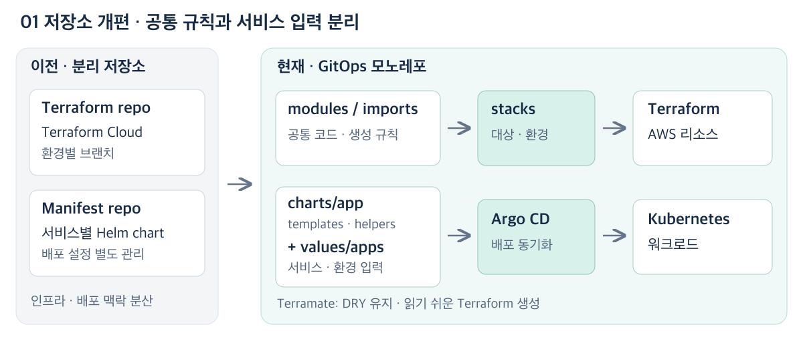
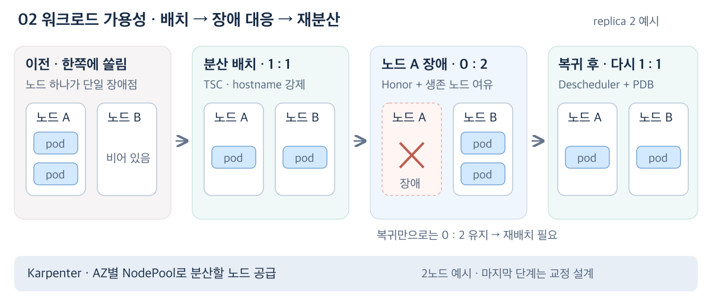
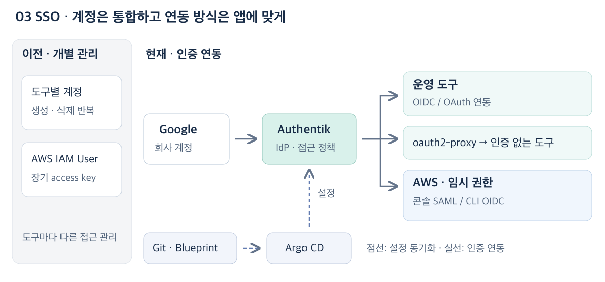
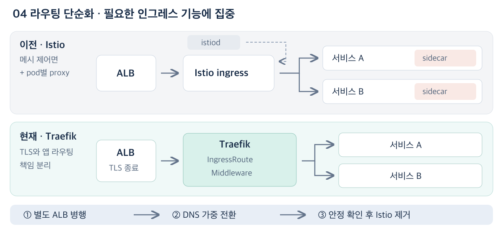

# DevOps 포트폴리오 — 팀이 이해하고 운영할 수 있는 플랫폼

**다음 사람이 읽고 변경하기 쉬운 구조**를 기준으로, 운영 복잡도와 장애·접근 관리 문제를 개선했다.

| 프로젝트 | 이전 문제 | 핵심 변화 |
|---|---|---|
| GitOps 재설계 | 환경·저장소마다 다른 설정 관리 | 모노레포 + 공통 생성 규칙 |
| EKS 가용성 | 한 노드에 몰린 replica | 배치·재배치·보호·노드 공급 분리 |
| Authentik SSO | 도구별 계정과 장기 access key | 중앙 인증 + 임시 자격 증명 |
| Istio → Traefik | 필요한 기능보다 큰 운영 부담 | L7 라우팅 중심으로 단순화 |

## 1. GitOps 재설계 — 공통 규칙과 환경 차이 분리

**문제:** 환경별 브랜치 동기화와 Terraform Cloud 비용에 더해, 인프라·배포 연결 변경도 두 저장소를 오가야 했다.

| 선택 | 왜 이 방식인가 | 구현 핵심 |
|---|---|---|
| S3 + GitHub Actions | Cloud 비용·환경 브랜치 동기화 부담 완화 | `main` + 환경 leaf, PR plan·merge apply |
| Terramate | 팀 가독성·DRY·직관적인 확장 | `globals`·`import`·native `.tf` 생성 |
| 모노레포 | 한 팀이 연결 변경을 한 PR로 검토 | 인프라·배포 설정을 한 컨텍스트에서 추적 |
| 공통 Helm | 서비스별 리소스 구조 복제 방지 | templates·helpers 공통화, values로 차이 입력 |

`stacks/acme/eks/main/dev` = **도메인 → 리소스 → 대상 → 환경**

Terragrunt도 HCL 기반 대안이다. 생성된 Terraform을 직접 읽는 방식이 더 직관적이었으며, Cloud UI와 지속적인 업데이트도 선택을 뒷받침했다.

**결과: backend 선언 39곳 → 생성 규칙 1곳. 69개 stack의 S3 backend 공통 관리.**

검증·한계: 코드 스냅샷으로 구조 확인. 공통 규칙 변경은 여러 서비스에 영향을 주므로 적용 범위 검토가 필요하다.

[상세 설계](devops-configs-architecture.md) · [공개 코드](https://github.com/b100to/devops-configs-portfolio/tree/7e3427a3a422f103cc6e4bc12adf79147ddacbec)

## 2. EKS 가용성 — replica 수보다 배치 위치

**문제:** replica가 한 노드에 몰려 노드 장애가 서비스로 전파됐고, 노드 복귀 뒤에도 쏠림이 남았다.

| 선택 | 왜 이 방식인가 | 구현 핵심 |
|---|---|---|
| TSC · 배치 | 쏠림 제한과 장애 중 복구를 함께 고려 | hostname 편차 1 강제·zone 권고·`Honor` |
| Descheduler · 재배치 | 실행 중인 Pod는 자동으로 재분산되지 않음 | 강제 제약 위반·대상 namespace만 교정 |
| PDB · 보호 | 재배치 중 동시 eviction 억제 | 자발적 중단 시 최소 가용 replica 유지 |
| Karpenter · 노드 공급 | Pod를 나눌 노드도 AZ별로 필요 | AZ별 NodePool과 pool별 교체 범위 설정 |

앱별 values로 점진 적용해 **JVM 동시 기동 부하**를 억제했다. `Honor`는 허용하지 않는 taint 노드를 분산 계산에서 제외한다.

**결과: 기존 kind 재현에서 replica 3개 기준 `Ignore`는 1개 Pending → `Honor`는 2:1 실행.**

검증·한계: Descheduler eviction은 로컬 재현 제외. PDB는 노드 장애를 막지 못하며 생존 노드의 여유 용량이 필요하다.

[상세 설계·재현](eks-workload-availability.md) · [공개 코드](https://github.com/b100to/devops-configs-portfolio/blob/7e3427a3a422f103cc6e4bc12adf79147ddacbec/values/apps/mall/v4/api/prd.yaml)

## 3. Authentik SSO — 인증 설정도 Git에서 리뷰

**문제:** 도구별 계정 생성·회수와 AWS 장기 자격 증명 관리가 분산되어 있었다.

| 선택 | 왜 이 방식인가 | 구현 핵심 |
|---|---|---|
| Authentik Blueprint | YAML 설정 관리가 기존 GitOps에 적합 | 앱·provider·정책을 Git에서 리뷰 |
| 앱별 연동 방식 | 앱이 가진 인증 기능을 우선 활용 | OIDC·OAuth 직접 연동, 미지원은 proxy |
| AWS 임시 자격 증명 | 장기 key 제거·CLI 반복 로그인 완화 | 콘솔 SAML, CLI OIDC·PKCE·token 갱신 |
| 시크릿·권한 분리 | secret 비공개와 최소 권한 유지 | Secrets Manager → ESO, 그룹별 접근 |

사용자당 SaaS 요금 대신 **self-host 운영 비용**을 감수했다. Keycloak도 코드 관리가 가능하며, 이 환경에서는 Blueprint 방식이 더 직접적이었다.

**결과: 도구별 계정을 중앙 인증으로 통합하고, AWS 장기 key를 임시 자격 증명으로 전환.**

검증·과제: Argo CD 정상 상태만으로 적용을 판단하지 않고 Blueprint 내부 상태를 확인한다. 실패 자동 감시와 IdP 가용성 관리가 필요하다.

[상세 설계·운영 이슈](sso-authentik.md) · [공개 코드](https://github.com/b100to/devops-configs-portfolio/blob/7e3427a3a422f103cc6e4bc12adf79147ddacbec/manifests/authentik/prd/blueprints.yaml)

## 4. Istio → Traefik — 실제 쓰는 기능에 맞추기

**문제:** 실제 요구는 L7 인그레스였지만, sidecar·Istio·Envoy까지 운영하고 인수인계해야 했다.

| 선택 | 왜 이 방식인가 | 구현 핵심 |
|---|---|---|
| Traefik | 인그레스 중심 요구·운영 부담 축소 | `IngressRoute` + 재사용 `Middleware` |
| 유지보수 전망 반영 | 전환 당시 ingress-nginx retirement 공지 | 단기간 내 재전환할 가능성 회피 |
| ALB·Traefik 역할 분리 | AWS와 앱 경로 변경을 따로 관리 | ALB는 TLS, Traefik은 앱 라우팅 |
| DNS 단계 전환 | 새 경로 문제 발생 시 되돌릴 수 있어야 함 | 기존·신규 ALB 병행, DNS 가중치 조정 |

**결과: 20여 개 서비스 전환, sidecar 주입·Istio 제어면 구성 제거.**

검증·한계: 경로 기능·요청·지연·에러율을 관찰하며 전환. 서비스 간 mTLS가 필요해지면 선택을 재검토한다.

[상세 설계·전환 절차](istio-to-traefik.md) · [공개 코드](https://github.com/b100to/devops-configs-portfolio/tree/7e3427a3a422f103cc6e4bc12adf79147ddacbec/manifests/traefik/prd)
