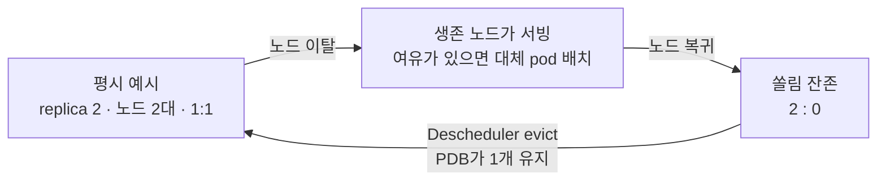

# 노드 한 대가 빠져도 서비스가 남도록: EKS 워크로드 분산 설계

운영 EKS 클러스터에서 노드 한 대가 NotReady가 되자 서비스가 같이 흔들린 장애를 계기로, 워크로드 분산을 **배치·재배치·보호·노드 공급** 네 층으로 다시 설계한 내용을 설명한다.

| 근거 | 대상 | 기준 |
|---|---|---|
| 설정 | [`devops-configs-portfolio`](https://github.com/b100to/devops-configs-portfolio) | commit [`7e3427a`](https://github.com/b100to/devops-configs-portfolio/tree/7e3427a3a422f103cc6e4bc12adf79147ddacbec) 정적 스냅샷 |
| 재현 | 이 저장소의 kind 클러스터 (Kubernetes v1.35, 운영과 같은 minor) | [`scripts/topology-spread-repro.sh`](../scripts/topology-spread-repro.sh) |

스냅샷은 설정을, 재현은 스케줄러 동작을 보여준다. 운영 클러스터의 현재 상태를 증명하는 문서는 아니다. 저장소 구조 자체는 [GitOps 저장소 아키텍처와 공통화 설계](devops-configs-architecture.md)에서 다룬다.

## 1. 문제: 노드 한 대가 곧 서비스 한 개였다

운영 서비스에서 간헐적인 장애가 이어졌다. 추적해 보니 pod들이 노드 한쪽에 몰려 있었고, 그 노드가 메모리 포화로 NotReady가 되면 그 위의 서비스가 함께 내려갔다. replica는 여러 개였지만 노드 기준으로는 하나였던 셈이다.

쏠림이 만드는 위험은 두 단계다.

| 빠지는 것 | 쏠려 있을 때 |
|---|---|
| 노드 한 대 | 그 노드에 몰린 앱은 replica가 전부 사라짐 |
| AZ 하나 | 그 AZ의 노드에 몰린 앱 전체가 같은 일을 겪음. 노드를 여러 AZ에 둔 의미가 없어짐 |

몰린 이유는 분산 제약이 없거나 **권고**였기 때문이다.

| 상태 | 결과 |
|---|---|
| `topologySpreadConstraints` 없음 | 기본 분산 선호와 다른 스케줄링 조건에 따라 배치되며, 앱의 강제 분산은 보장하지 않음 |
| `whenUnsatisfiable: ScheduleAnyway` | `maxSkew: 1`이 있어도 점수에만 반영. 압박을 받으면 한 노드에 전부 들어감 |
| 재배치 수단 없음 | 노드 재기동 뒤 한 번 몰리면 그대로 고착 |

공통 차트의 기본값이 바로 그 권고였다. [`_helpers.tpl`](https://github.com/b100to/devops-configs-portfolio/blob/7e3427a3a422f103cc6e4bc12adf79147ddacbec/charts/app/templates/_helpers.tpl)의 기본 제약은 zone과 hostname 모두 `ScheduleAnyway`로 렌더링된다.

이 문제가 특히 아팠던 배경이 있다. 노드 수를 줄이려고 대형 인스턴스를 AZ당 1대씩 두는 구성이라, 노드 한 대가 곧 용량의 절반이다. 노드가 적을수록 분산은 선택이 아니라 전제가 된다.

## 2. 설계: 네 개의 층

한 도구로는 풀리지 않는다. 각 도구가 **못 하는 일**을 다음 층이 받는 구조다.

| 층 | 도구 | 맡는 일 | 못 하는 일 |
|---|---|---|---|
| 배치 | TopologySpreadConstraints | 스케줄 시점에 쏠림을 차단 | 이미 놓인 pod은 옮기지 않음 |
| 재배치 | Descheduler | 복구 뒤 남은 쏠림을 evict로 교정 | 어디로 갈지는 정하지 않음 (스케줄러 몫) |
| 보호 | PodDisruptionBudget | 자발적 eviction에서 최소 replica 보장 | 노드 장애 같은 비자발적 중단은 못 막음 |
| 노드 공급 | Karpenter NodePool | AZ별 공급 경로와 NodePool별 중단 예산 설정 | 기존 pod을 직접 재배치하지 않음 |



## 3. 배치: TopologySpreadConstraints

운영 앱의 제약은 두 줄이다. [`mall v4 API prd values`](https://github.com/b100to/devops-configs-portfolio/blob/7e3427a3a422f103cc6e4bc12adf79147ddacbec/values/apps/mall/v4/api/prd.yaml)의 관련 필드 발췌:

```yaml
topologySpreadConstraints:
  - topologyKey: topology.kubernetes.io/zone
    maxSkew: 1
    whenUnsatisfiable: ScheduleAnyway   # zone 은 best-effort
    nodeTaintsPolicy: Honor
    matchLabelKeys: [pod-template-hash]
  - topologyKey: kubernetes.io/hostname
    maxSkew: 1
    whenUnsatisfiable: DoNotSchedule    # 적격 hostname 간 개수 차이를 1 이하로 제한
    nodeTaintsPolicy: Honor
    matchLabelKeys: [pod-template-hash]
```

`maxSkew: 1`은 노드당 1개 제한이 아니다. 적격 노드 2대에서 동일 리비전의 replica가 2개면 1:1, 3개면 2:1도 허용한다. 명시적 TSC가 없어도 스케줄러의 기본 분산 선호는 적용될 수 있다. [Kubernetes TSC 정의와 기본 동작](https://kubernetes.io/docs/concepts/scheduling-eviction/topology-spread-constraints/)

hostname만 강제하고 zone은 권고로 둔 이유는 AZ당 적격 앱 노드 1대를 운영하는 구성에 있다(6절). 이 조건에서는 hostname 분산이 AZ 분산으로 이어진다. zone은 장애 중 배치 유연성을 우선해 권고로 두었으며, 노드 수나 AZ별 분포가 달라지면 zone 제약도 재검토해야 한다.

| 필드 | 없으면 생기는 일 |
|---|---|
| `whenUnsatisfiable: DoNotSchedule` | 제약이 권고로 남아 쏠림을 허용 |
| `nodeTaintsPolicy: Honor` | 갈 수 없는 노드가 분산 계산에 끼어 Pending (3-1, 3-2) |
| `matchLabelKeys: [pod-template-hash]` | 구·신 버전을 합산해 신버전 분포가 치우치거나 롤아웃이 지연될 수 있음 (3-3) |

세 필드를 함께 검토했다. 강제 분산만 켜면 taint와 롤아웃 중 리비전 합산으로 생기는 배치 문제를 놓칠 수 있다.

### 3-1. `Honor`가 없으면: 유령 도메인

기본값 `Ignore`는 **pod이 갈 수 없는 taint 노드도 분산 도메인으로 센다.** 이 클러스터에는 batch·airflow 전용 NodePool이 taint를 달고 있다([`batch.yaml`](https://github.com/b100to/devops-configs-portfolio/blob/7e3427a3a422f103cc6e4bc12adf79147ddacbec/manifests/karpenter/prd/batch.yaml)). 앱 pod 입장에서 그 노드들은 영원히 0개인 도메인이다.

```text
replica 3, 앱 노드 2대 + taint 노드 1대

Ignore   app-1: 1   app-2: 1   tainted: 0     3번째를 app-1 에 놓으면 2 vs 0 = skew 2  → Pending
Honor    app-1: 1   app-2: 1                  3번째를 app-1 에 놓으면 2 vs 1 = skew 1  → 배치
```

replica 2는 1:1에서 멈추므로 우연히 안전하고, replica 3부터 터진다. 그래서 테스트에서 놓치기 쉽다.

로컬 재현(taint 걸린 infra 노드 1대 + app 노드 2대):

| 설정 | 결과 |
|---|---|
| `Ignore` (기본값) | 2개 Running, 1개 Pending — `2 node(s) didn't match pod topology spread constraints, 2 node(s) had untolerated taint(s)` |
| `Honor` | 3개 Running, 2:1 |

### 3-2. `Honor`의 두 번째 효과: 노드가 빠진 동안의 복구

노드가 NotReady가 되면 노드 컨트롤러가 `node.kubernetes.io/not-ready:NoSchedule` taint를 붙인다. 스케줄러에게 그 노드는 3-1의 taint 노드와 같은 존재가 된다. 즉 `Ignore`에서는 **죽은 노드가 0개짜리 도메인으로 남아, 살아 있는 노드에 대체 pod을 올리는 것을 막는다.**

로컬 재현(replica 2, 한 노드에 tolerate하지 않는 `NoSchedule` taint를 걸고 그 노드의 pod을 삭제):

| 설정 | 노드가 빠진 동안 | 의미 |
|---|---|---|
| `Ignore` | 대체 pod Pending | 장애 내내 replica 1개로 버팀 |
| `Honor` | 대체 pod이 생존 노드에 Running | 생존 노드에 여유가 있으면 스케줄 후 Ready 완료 시 서빙 용량 회복 가능 |

강제 분산은 “노드 장애에 대비한다”는 목적과 반대로, 장애 중 복구를 막을 수 있다. `Honor`가 그 모순을 푼다. 재현은 실제 노드 정지가 아니라 스케줄러가 보는 조건(tolerate하지 않는 taint)을 만든 것이다.

### 3-3. `matchLabelKeys`: 리비전별 분산

롤링 업데이트 중에는 구버전과 신버전 pod이 같은 selector에 함께 잡힌다. 이 합산이 항상 배포를 막는 것은 아니지만, 구버전 삭제 순서와 노드 여유에 따라 신버전 분포가 치우치거나 배치가 지연될 수 있다. `pod-template-hash`를 키로 주면 리비전별로 따로 센다. [Kubernetes `matchLabelKeys`](https://kubernetes.io/docs/concepts/scheduling-eviction/topology-spread-constraints/#spread-constraint-definition)

### 3-4. 적용 방식: 차트 기본값이 아니라 앱별 values

차트 helper를 고치면 한 줄로 끝나지만, 그 차트를 쓰는 모든 앱이 동시에 롤아웃된다. JVM 앱은 기동 시 CPU와 메모리를 크게 쓰므로, 분산을 고치려다 노드 압박을 다시 만들 수 있었다.

| 방식 | 롤아웃 범위 | 선택 |
|---|---|---|
| 공통 차트 helper 수정 | 차트 소비 앱 전체가 동시에 | 보류 |
| 앱별 values에 명시 (`defaultTopologySpread.enabled: false`) | 그 앱만 | 채택. non-JVM 먼저, JVM은 2~3개씩 나눠 적용하고 매번 분포 확인 |

[아키텍처 문서 7절](devops-configs-architecture.md#7-변경-경계와-트레이드오프)의 질문 — 한 앱의 예외인가, 공유 계약인가 — 을 **변경 시점의 위험** 기준으로 한 번 더 적용한 사례다. 최종적으로는 공유 계약이 되어야 하지만, 거기까지 가는 길은 앱 단위로 끊었다.

## 4. 재배치: Descheduler

TSC는 스케줄 시점에만 작동한다. 3-2의 재현을 이어가면 그 한계가 보인다.

| 시점 | `Honor` 쪽 분포 |
|---|---|
| 노드가 빠진 동안 | 생존 노드에 2 |
| 노드 복귀 뒤 | **여전히 2 : 0** — 아무도 옮기지 않음 |

용량을 지킨 대가로 쏠림이 남는다. 처음 장애의 원인과 같은 상태다. 이것을 주기적으로 교정하는 것이 Descheduler다. [`descheduler prd values`](https://github.com/b100to/devops-configs-portfolio/blob/7e3427a3a422f103cc6e4bc12adf79147ddacbec/values/infra/descheduler/prd.yaml)의 관련 필드 발췌:

```yaml
kind: CronJob
schedule: "*/10 * * * *"
deschedulerPolicy:
  profiles:
    - name: topology-spread-rebalance
      pluginConfig:
        - name: RemovePodsViolatingTopologySpreadConstraint
          args:
            constraints: [DoNotSchedule]
            namespaces:
              include: [mall, healthcare, default]
      plugins:
        balance:
          enabled: [RemovePodsViolatingTopologySpreadConstraint]
```

범위를 의도적으로 좁혔다.

| 결정 | 이유 |
|---|---|
| 플러그인은 `RemovePodsViolatingTopologySpreadConstraint` 하나 | `LowNodeUtilization` 같은 넓은 전략은 evict 대상이 예측하기 어려움. 풀려는 문제는 분산 위반 하나 |
| `constraints: [DoNotSchedule]`만 | 강제한 제약의 위반만 교정. 권고(zone) 위반으로는 evict하지 않음 |
| namespace 한정 | 강제 분산을 적용한 앱 namespace만 |
| 10분 주기 CronJob | 차트 기본값(2분)보다 느슨하게. 첫 배포는 보수적으로 |

배포는 [`Argo CD Application`](https://github.com/b100to/devops-configs-portfolio/blob/7e3427a3a422f103cc6e4bc12adf79147ddacbec/argocd/prd/infra/ops/descheduler.yaml)이 upstream chart와 저장소의 values를 multi-source로 묶는다.

## 5. 보호: PodDisruptionBudget

Descheduler를 넣는 순간 새 위험이 생긴다. 분산을 맞추려고 evict하다가 replica 2~3개짜리 서비스를 **한꺼번에** 내릴 수 있다. Descheduler는 Eviction API로만 pod을 내리고, Eviction API는 PDB를 확인한다. 그래서 Descheduler 쪽에 별도의 최소 replica 옵션을 두지 않고 PDB 하나로 막는다.

```yaml
podDisruptionBudget:
  enabled: true
  minAvailable: 1
```

[`pdb.yaml`](https://github.com/b100to/devops-configs-portfolio/blob/7e3427a3a422f103cc6e4bc12adf79147ddacbec/charts/app/templates/pdb.yaml) template은 기본 `enabled: false`다. 차트에 기능을 추가해도 기존 릴리스의 렌더링 결과는 바뀌지 않고, 서비스별로 켠다.

같은 PDB가 Karpenter의 노드 교체(만료·consolidation)와 수동 drain에서도 작동한다. 반대로 노드 장애처럼 **비자발적** 중단에는 관여하지 못한다. 그쪽은 3절의 몫이다.

## 6. 노드 공급: Karpenter

pod을 노드에 나눠 놓으려면 노드가 먼저 나뉘어 있어야 한다. Karpenter에 맡겨 두면 두 노드가 같은 AZ에 뜰 수 있다.

| 설정 | 효과 |
|---|---|
| NodePool을 AZ별로 분리 (`base`, `base-b`), 각각 zone requirement 고정 | 앱 노드가 서로 다른 AZ에 놓임 |
| `limits.cpu` = 인스턴스 1대분 | 8vCPU 타입과 한도 8로 NodePool당 통상 1대 운영을 목표로 함 |
| `expireAfter`를 서로 다르게 (720h / 1080h) | 최초 만료 시점 분산. 이후 생성·교체 시점에 따라 겹칠 수 있음 |
| `disruption.budgets: nodes: "1"` | 각 NodePool의 drift·consolidation 등 예산 대상 중단을 최대 1대로 제한 |

CPU 한도 검사는 eventual consistency이므로 일시 초과할 수 있고, 각 AZ에 최소 1대 존재하는 것도 보장하지 않는다. [Karpenter limits](https://karpenter.sh/docs/concepts/nodepools/#speclimits)

중단 예산은 NodePool별이므로 두 pool의 동시 중단을 막는 전역 제한이 아니다. 만료는 이 예산의 제어 대상이 아니며, 서로 다른 `expireAfter`도 동시 교체를 보장해 막지는 않는다. [Karpenter 중단 예산과 만료](https://karpenter.sh/docs/concepts/disruption/)

[`nodepool.yaml.tmpl`](https://github.com/b100to/devops-configs-portfolio/blob/7e3427a3a422f103cc6e4bc12adf79147ddacbec/stacks/acme/manifests/karpenter/prd/nodepool.yaml.tmpl)의 관련 필드 발췌:

```yaml
spec:
  template:
    spec:
      expireAfter: ${expire_after}
      requirements:
        - key: topology.kubernetes.io/zone
          operator: In
          values: ["${availability_zone}"]
  limits:
    cpu: ${cpu_limit}
  disruption:
    consolidationPolicy: WhenEmptyOrUnderutilized
    consolidateAfter: 10m
    budgets:
      - nodes: "1"
```

첫 번째 NodePool은 [공통 모듈](https://github.com/b100to/devops-configs-portfolio/blob/7e3427a3a422f103cc6e4bc12adf79147ddacbec/modules/manifests/karpenter/main.tm.hcl)이 생성하고, 두 번째는 [prd stack](https://github.com/b100to/devops-configs-portfolio/blob/7e3427a3a422f103cc6e4bc12adf79147ddacbec/stacks/acme/manifests/karpenter/prd/nodepool_b.tf)에만 직접 작성되어 있다. dev에는 AZ 이중화가 필요 없기 때문이다. 공통 생성과 leaf 직접 작성을 섞는 방식은 아키텍처 문서 4절의 구조를 그대로 쓴다.

## 7. 장애 시나리오로 다시 읽기

| 단계 | 일어나는 일 | 작동하는 층 |
|---|---|---|
| 평시 예시 | 동일 리비전 replica 2개·적격 노드 2대에서 1 : 1 | TSC hostname `DoNotSchedule` |
| 노드 A NotReady | 노드 B의 replica가 계속 서빙 | 위 배치의 결과 |
| 대체 pod 생성 | 죽은 노드를 계산에서 빼고, 여유가 있는 노드 B에 배치 | TSC `nodeTaintsPolicy: Honor` |
| 노드 복귀 또는 교체 | 분포는 2 : 0 그대로 | (아무도 옮기지 않음) |
| 10분 주기 교정 시도 | PDB가 허용하면 위반 pod evict, 최소 1개 유지 | Descheduler + PDB |
| 재스케줄 | 비어 있는 노드로 배치되어 1 : 1 | TSC |

10분은 실행 주기이며 복구 완료 보장이 아니다. Job 실행 지연, PDB, 가용 용량과 pod Ready 시간에 따라 교정이 늦어질 수 있다. [Kubernetes CronJob 한계](https://kubernetes.io/docs/concepts/workloads/controllers/cron-jobs/#cronjob-limitations)

운영 환경에서도 단일 노드 이탈 시 워크로드가 다른 노드로 재배치되고 서비스가 유지되는 것을 확인했다. 이 문장은 운영 관찰이며 스냅샷으로 증명되는 내용은 아니다.

## 8. 검증한 것

| 대상 | 방법 | 결과 |
|---|---|---|
| 차트 렌더링 | `helm template mall-v4-api charts/app -n mall -f values/apps/mall/v4/api/prd.yaml` | Deployment에 3절의 제약 두 줄, PDB `minAvailable: 1`, HPA 생성 |
| 차트 기본값 | `helm template t charts/app` | zone·hostname 모두 `ScheduleAnyway` |
| 유령 도메인 (3-1) | kind, replica 3 | `Ignore` 1개 Pending / `Honor` 2:1 |
| 장애 중 복구 (3-2) | kind, replica 2, 노드 taint + pod 삭제 | `Ignore` Pending / `Honor` 생존 노드에 Running |
| 복귀 뒤 쏠림 (4절) | 위 실험에서 taint 제거 | `Honor` 쪽 2:0 유지 |

재현 스크립트는 임시 namespace를 만들고 끝나면 taint와 namespace를 지운다. Descheduler의 evict 동작은 로컬에서 재현하지 않았다.

## 9. 한계와 남은 과제

| 항목 | 상태 |
|---|---|
| 차트 기본값 | 여전히 `ScheduleAnyway`. `values.yaml`의 `defaultTopologySpread.whenUnsatisfiable` 키는 helper가 읽지 않아 값을 바꿔도 렌더링이 변하지 않는다. 앱별 적용이 끝났으므로 helper를 이 키에 연결해 기본값을 승격하는 것이 다음 단계 |
| 적용 범위 | 스냅샷 기준 prd 앱 values 23개 중 hostname 강제 10개, PDB 9개. 강제 분산을 쓰면서 `Honor`와 PDB가 빠진 앱이 1개 있다 |
| 생존 노드의 여유 | `Honor`는 장애 중 pod을 생존 노드에 모은다. 그 노드가 전체 부하를 받을 requests 여유가 없으면 처음 장애(메모리 포화)를 옮겨 놓는 셈이다. requests 산정이 이 설계의 전제 |
| 대상 밖 | PV가 AZ에 묶인 StatefulSet, 단일 replica, DaemonSet, EKS managed addon |
