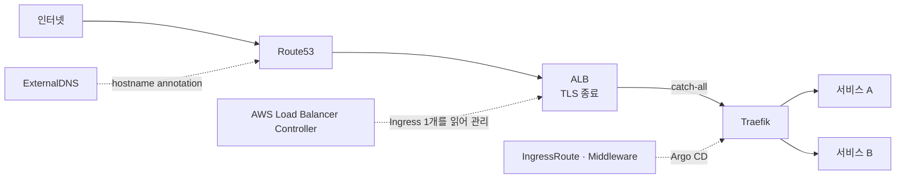

# 서비스 메시를 걷어내기: Istio에서 Traefik으로

서비스 메시를 도입하는 글은 많고 걷어내는 글은 적다. 이 문서는 운영 중인 EKS 클러스터에서 Istio를 제거하고 Traefik으로 옮긴 판단과 과정을 설명한다. 핵심은 도구 교체가 아니라 **"우리가 실제로 쓰고 있는 기능이 무엇인가"를 센 것**이다.

| 근거 | 대상 | 기준 |
|---|---|---|
| 전환 전 | [`manifest-k8s-cluster-portfolio`](https://github.com/b100to/manifest-k8s-cluster-portfolio) | commit [`ed4f0a3`](https://github.com/b100to/manifest-k8s-cluster-portfolio/tree/ed4f0a3891a8bc075ed54113d2fdaebf25f58fcb) |
| 전환 후 | [`devops-configs-portfolio`](https://github.com/b100to/devops-configs-portfolio) | commit [`7e3427a`](https://github.com/b100to/devops-configs-portfolio/tree/7e3427a3a422f103cc6e4bc12adf79147ddacbec) |

두 스냅샷의 설정을 비교한 문서이며, 운영 클러스터의 현재 상태를 증명하지는 않는다. 전환 전 스냅샷은 일부 서비스만 담고 있다. 저장소 구조는 [GitOps 저장소 아키텍처와 공통화 설계](devops-configs-architecture.md)에서 다룬다.

## 1. 문제: 메시 값을 내고 인그레스만 쓰고 있었다

불편은 두 쪽에서 왔다.

| 누가 | 무엇이 힘들었나 |
|---|---|
| 개발자 | 요청이 어디서 막혔는지 찾기 어려움. 구조를 이해하려면 Istio부터 알아야 함. 새로 온 사람에게 인수인계가 어려움 |
| 플랫폼 엔지니어 | pod마다 붙는 sidecar proxy 관리, Istio 고유의 설정 체계, 그리고 문제가 생기면 결국 Envoy까지 내려가야 하는 디버깅 |

학습해야 할 층이 세 겹이었다.

```text
Kubernetes  →  Istio (Gateway · VirtualService · 주입 규칙)  →  Envoy (실제 동작과 로그)
```

Envoy 수준까지 익히는 일은 우선순위가 될 수 없었다. 플랫폼을 운영하는 사람이 적었고, 같은 시간에 해야 할 일이 더 많았다.

그래서 **무엇을 쓰고 있는지**를 셌다. 전환 전 스냅샷의 Istio 리소스:

| 리소스 | 수 | 역할 |
|---|---|---|
| `Gateway` | 4 | 인그레스 호스트 선언 |
| `VirtualService` | 4 | 경로 매칭, rewrite, 목적지 지정 |
| `DestinationRule`, `PeerAuthentication`, `AuthorizationPolicy`, `EnvoyFilter` 등 | 0 | 트래픽 정책, mTLS, 서비스 간 인가 |

쓰고 있던 것은 L7 인그레스 라우팅이 전부였다. [`VirtualService template`](https://github.com/b100to/manifest-k8s-cluster-portfolio/blob/ed4f0a3891a8bc075ed54113d2fdaebf25f58fcb/acmemall-backend-v4/api-admin/helm/templates/virtualservice.yaml)은 prefix를 매칭해 `/`로 rewrite하고 서비스로 보내는 것이 전부다. 메시를 메시답게 만드는 기능은 선언된 적이 없었다.

반대로 비용은 전부 내고 있었다.

| 비용 | 내용 |
|---|---|
| pod당 고정 오버헤드 | 주입 대상 namespace의 모든 pod에 proxy 컨테이너가 하나씩 붙음. 서비스가 한가해도 요청값은 그대로 |
| 제어면 | `istiod`와 ingress gateway를 별도로 운영하고 업그레이드해야 함 |
| 예외 처리 | 배치 Job은 sidecar가 끝나지 않아 완료되지 못하므로 [`sidecar.istio.io/inject: "false"`](https://github.com/b100to/manifest-k8s-cluster-portfolio/blob/ed4f0a3891a8bc075ed54113d2fdaebf25f58fcb/acmemall-backend-v4/batch/templates/cronjob.yaml)를 따로 달아야 했음 |
| 인지 부하 | 위의 세 겹 |

## 2. 판단: 메시가 필요한 조건인가

| 메시가 값을 하는 조건 | 이 환경 |
|---|---|
| 서비스 간 호출이 많고 그 그래프가 복잡함 | 서비스 20여 개. MSA 경계가 뚜렷하지 않고 대부분의 트래픽이 외부 → 서비스 방향 |
| 서비스 간 mTLS와 인가를 정책으로 강제해야 함 | 선언된 정책 0 |
| 카나리·미러링 같은 세밀한 트래픽 제어를 일상적으로 씀 | 사용하지 않음 |
| 메시를 전담할 사람이 있음 | 없음 |

어느 행에도 해당하지 않았다. 남은 질문은 "메시 없이 지금 쓰는 기능을 그대로 할 수 있는가"였고, 필요한 기능 목록은 짧았다.

| 실제로 필요한 것 | 근거 |
|---|---|
| host·path 라우팅과 우선순위 | 한 호스트 아래 `/seller/`, `/admin/`, `/`가 다른 서비스로 감 |
| path prefix 제거 | 기존 `rewrite: uri: /` |
| CORS 헤더 | 브라우저에서 직접 호출하는 API |
| IP allowlist | 사내 도구 |
| rate limit, retry, 압축 | 공통 middleware |

비용을 줄여야 하는 시기였다는 점도 같은 방향을 가리켰다. 쓰지 않는 기능을 위해 pod마다 자원을 예약해 둘 이유가 없었다.

## 3. 대안 비교: 왜 Traefik인가

| 선택지 | 판단 |
|---|---|
| Istio 유지 | 1~2절의 문제가 그대로 남음 |
| ALB 단독 (AWS Load Balancer Controller의 Ingress만 사용) | host·path 라우팅은 되지만 prefix 제거, CORS 헤더 조작, rate limit 같은 L7 가공을 할 수 없음. 서비스마다 ALB 규칙이 늘어 AWS 쪽 변경이 잦아짐 |
| ingress-nginx | 사실상의 표준이지만 **retirement가 발표됨.** 2026년 3월까지 best-effort 유지보수, 그 뒤로는 릴리스와 보안 패치가 없음 ([Kubernetes 공지](https://kubernetes.io/blog/2025/11/11/ingress-nginx-retirement/)) |
| Traefik | 필요한 기능을 `IngressRoute`와 `Middleware` 두 CRD로 선언. 유지보수가 활발함 |

가장 익숙한 선택지는 ingress-nginx였다. 하지만 복잡도를 줄이려고 옮기는 마당에, 옮기자마자 다시 옮겨야 할 도구를 고를 수는 없었다. 이 전환의 시점(2025년 12월)이 공지 직후였다는 점이 결정을 단순하게 만들었다. 도구를 고를 때 기능표만큼 **그 도구가 3년 뒤에도 패치되는가**를 본다.

Traefik을 고른 두 번째 이유는 설정의 모양이다. 라우팅 규칙이 annotation 문자열이 아니라 CRD 필드라서 Git diff로 읽히고, 재사용할 가공 단계는 `Middleware`로 떼어 여러 라우트가 참조한다.

## 4. 설계: AWS 리소스와 애플리케이션 라우팅을 분리

Traefik만 넣은 것이 아니라 **누가 무엇을 소유하는지**를 나눴다.



| 층 | 소유자 | 맡는 것 | 바뀌는 때 |
|---|---|---|---|
| AWS 리소스 | AWS Load Balancer Controller + ExternalDNS | ALB, listener, ACM 인증서, health check, access log, DNS 레코드 | 도메인·인증서가 추가될 때 |
| 애플리케이션 라우팅 | Traefik | host·path 매칭, prefix 제거, CORS, allowlist, rate limit | 서비스가 추가되거나 경로가 바뀔 때 |

연결점은 [`Ingress` 하나](https://github.com/b100to/devops-configs-portfolio/blob/7e3427a3a422f103cc6e4bc12adf79147ddacbec/manifests/traefik/prd/alb.yaml)다. 관련 필드 발췌:

```yaml
kind: Ingress
metadata:
  annotations:
    alb.ingress.kubernetes.io/target-type: ip          # pod IP 를 직접 타깃으로
    alb.ingress.kubernetes.io/ssl-redirect: "443"
    alb.ingress.kubernetes.io/healthcheck-path: /ping  # Traefik 의 health endpoint
    alb.ingress.kubernetes.io/healthcheck-port: "9000"
spec:
  ingressClassName: alb
  rules:
    - http:
        paths:
          - path: /                                    # 전부 Traefik 으로
            backend: { service: { name: traefik, port: { number: 80 } } }
```

ALB는 규칙을 하나만 가진다. 서비스가 늘어도 AWS 쪽은 변하지 않고, 인증서를 바꿔도 라우팅은 건드리지 않는다. 두 종류의 변경이 서로의 리뷰와 장애 반경에 들어오지 않는다.

계획 단계와 달라진 점이 하나 있다. [마이그레이션 계획](https://github.com/b100to/devops-configs-portfolio/blob/7e3427a3a422f103cc6e4bc12adf79147ddacbec/docs/runbooks/traefik-migration-plan.md)은 Terraform으로 만든 ALB가 NodePort로 Traefik에 붙는 구조였고, 최종 구조는 Load Balancer Controller가 관리하는 ALB가 pod IP를 직접 타깃으로 삼는다. 노드는 Karpenter가 수시로 교체하므로, 타깃이 노드가 아니라 pod을 따라가는 쪽이 타깃 그룹을 안정적으로 유지한다.

## 5. 옮기기: VirtualService에서 IngressRoute로

| Istio | Traefik |
|---|---|
| `Gateway` (hosts, ingressgateway selector) | `IngressRoute`의 `Host()` matcher. 별도 리소스 불필요 |
| `VirtualService`의 `match.uri.prefix` | `PathPrefix()` + `priority` |
| `rewrite: uri: /` | `Middleware` `stripPrefix` |
| `route.destination` | `services` |
| (서비스 chart마다 template) | 환경별 파일 몇 개에 모음 |

전환 전, 서비스 chart 안의 template:

```yaml
kind: VirtualService
spec:
  gateways: [<gateway>]
  http:
    - match: [{ uri: { prefix: /admin } }]
      rewrite: { uri: / }
      route: [{ destination: { host: <service>, port: { number: 80 } } }]
```

전환 후, [`mall.yaml`](https://github.com/b100to/devops-configs-portfolio/blob/7e3427a3a422f103cc6e4bc12adf79147ddacbec/manifests/traefik/prd/mall.yaml)의 관련 필드 발췌:

```yaml
kind: IngressRoute
spec:
  routes:
    - match: Host(`api-v4...`) && PathPrefix(`/admin/`)
      priority: 20
      middlewares: [{ name: strip-admin-prefix }, { name: cors-headers }]
      services:    [{ name: mall-v4-api-admin, port: 80 }]
    - match: Host(`api-v4...`) && PathPrefix(`/`)
      priority: 10
      services:    [{ name: mall-v4-api, port: 80 }]
```

위치도 옮겼다. 라우팅이 서비스 chart의 template에 흩어져 있을 때는 "이 호스트로 들어온 요청이 어디로 가는가"에 답하려면 chart 여러 개를 열어야 했다. 지금은 [`manifests/traefik/<env>/`](https://github.com/b100to/devops-configs-portfolio/tree/7e3427a3a422f103cc6e4bc12adf79147ddacbec/manifests/traefik/prd) 아래 도메인별 파일에 모여 있다. 스냅샷 기준 `IngressRoute` 38개, `Middleware` 29개, prd 호스트 21개다.

같은 경로를 두 곳에서 정의하지 않도록 규칙도 하나 두었다. Traefik이 라우팅하는 서비스는 Helm chart의 ingress를 끈다.

## 6. 전환: 끊지 않고 옮기기

| 단계 | 한 일 | 되돌리는 방법 |
|---|---|---|
| 0. 병행 준비 | 새 ALB를 기존 Istio ALB 옆에 세움. 테스트용 도메인만 연결 | 새 ALB 삭제 |
| 1. Traefik 배포 | Argo CD로 배포, ALB health check가 `/ping`에서 통과하는지 확인 | Application 삭제 |
| 2. 쉬운 것부터 | 내부 도구 하나를 테스트 도메인으로 먼저 | DNS 레코드 삭제 |
| 3. 어려운 것 검증 | prefix rewrite와 CORS가 있는 API를 경로별로 확인 | 〃 |
| 4. 트래픽 이동 | Route53 가중치 레코드로 **90:10 → 50:50 → 0:100**, 단계 사이 10분 관찰 | 가중치를 되돌림 |
| 5. 관찰 | 요청 수, 지연, 에러율을 Traefik 메트릭과 access log로 확인 | 〃 |
| 6. Istio 제거 | 안정 기간 뒤 VirtualService·Gateway → ingress gateway → control plane 순으로 삭제 | (이 시점부터 롤백 계획 폐기) |

핵심은 4단계다. 옛 경로와 새 경로가 **각자의 ALB로 동시에 살아 있고**, 전환은 DNS 가중치 숫자 하나다. 롤백도 같은 숫자를 되돌리는 것이라 새 경로에 문제가 있어도 옛 경로는 손대지 않은 채 그대로다. [`dns-weighted-migrate.sh`](https://github.com/b100to/devops-configs-portfolio/blob/7e3427a3a422f103cc6e4bc12adf79147ddacbec/scripts/dns-weighted-migrate.sh)가 도메인별로 이 단계를 실행한다.

제거 순서도 의도적이다. 의존하는 쪽부터 지운다. 라우팅 리소스, ingress gateway, 제어면 순이다. 제어면을 먼저 지우면 그것에 의존하는 컴포넌트가 설정을 받지 못한 채 남는 구간이 생긴다.

## 7. 진입점이 하나가 되었으므로

모든 외부 트래픽이 Traefik을 지난다. 단일 장애점이 되지 않도록 [`prd values`](https://github.com/b100to/devops-configs-portfolio/blob/7e3427a3a422f103cc6e4bc12adf79147ddacbec/values/infra/traefik/prd.yaml)에 가용성 설정을 묶었다.

| 설정 | 값 |
|---|---|
| HPA | 3 ~ 10 |
| PDB | `minAvailable: 2` |
| 분산 | zone 권고 + hostname 강제, `nodeTaintsPolicy: Honor` |
| 우선순위 | `system-cluster-critical` |
| `X-Forwarded-For` 신뢰 | VPC 대역에서 온 요청만 |

replica 3 이상에서 `Honor`가 빠지면 세 번째 pod이 Pending에 걸린다. 실제로 Traefik에 강제 분산을 처음 적용했을 때 이 일을 겪었다. 원리와 재현은 [EKS 워크로드 분산 설계](eks-workload-availability.md) 3-1절에 있다.

## 8. 결과

| 항목 | 전환 전 | 전환 후 |
|---|---|---|
| pod 구성 | 앱 + sidecar proxy | 앱만 |
| 상시 운영 컴포넌트 | `istiod`, ingress gateway, 모든 pod의 sidecar | Traefik Deployment 하나 |
| 구조를 이해하려면 | Kubernetes + Istio + Envoy | Kubernetes + CRD 두 종류 |
| "이 요청이 어디로 가나" | 서비스 chart들의 template | 환경별 라우팅 파일 |
| 디버깅 | sidecar와 gateway의 Envoy 로그 | Traefik JSON access log를 호스트로 필터 |
| 새 서비스 노출 | chart에 Gateway·VirtualService 값 추가 | `IngressRoute` 추가 + hostname annotation 한 줄 |
| 배치 Job | sidecar 주입 예외 처리 필요 | 불필요 |

20여 개 서비스를 옮겼다. 자원 측면에서는 제어면과 gateway에 더해 **pod 수에 비례하던 sidecar 요청값**이 사라졌다. Istio의 기본 sidecar 요청값은 CPU 100m, 메모리 128Mi이고, 이것이 서비스 부하와 무관하게 replica마다 예약된다. 실측 절감치는 이 스냅샷에 없다.

가장 크게 바뀐 것은 인수인계다. 새로 온 사람에게 설명할 그림이 "ALB → Traefik → 서비스" 한 줄이 되었다.

## 9. 잃은 것과 남은 것

| 항목 | 상태 |
|---|---|
| 서비스 간 mTLS | 없음. 쓰던 기능이 아니라 잃은 것은 없지만, 요구가 생기면 메시 없이 풀 방법을 다시 찾아야 함 |
| 서비스 간 호출 관측 | 메시 텔레메트리 없음. 서비스 간 추적은 APM에 의존 |
| 조용히 무시되는 설정 | Traefik은 잘못된 matcher 이름(`HeadersRegexp`)이나 namespace를 빠뜨린 `Middleware` 참조를 에러 없이 무시함. 라우트가 "없는" 증상으로만 나타남 ([SSO 문서](sso-authentik.md) 5-3절) |
| 도메인 목록이 한 곳에 | 모든 호스트가 Ingress 하나의 annotation에 있어 변경이 한 파일에 몰림. 역할 분리의 대가 |
| Istio 흔적 | 배치 chart에 `disableIstio` 옵션 등 쓰이지 않는 설정이 남아 있음 |
| Ingress API의 다음 | upstream은 Gateway API를 권장. Traefik도 구현하고 있어 경로는 열려 있으나 아직 옮기지 않음 |

메시가 틀린 도구였던 것은 아니다. **이 규모와 이 팀에 맞지 않았을 뿐이다.** 조건이 2절의 표에 해당하게 되면 다시 검토할 일이다.
