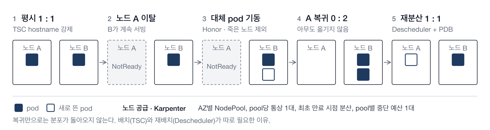
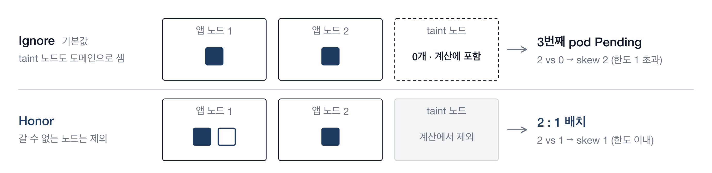
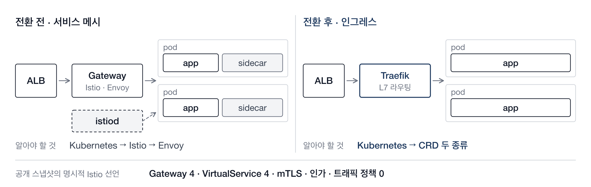
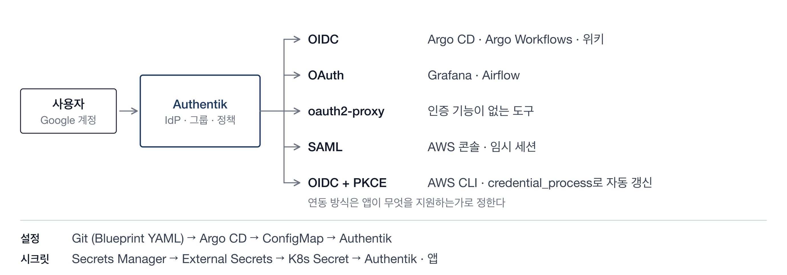
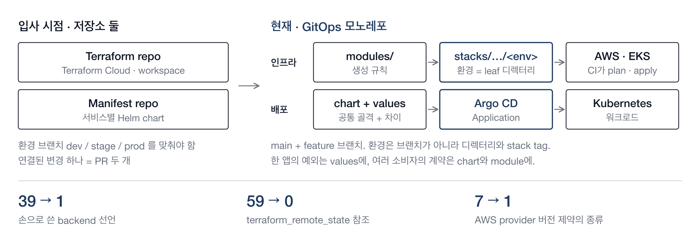

# 플랫폼 엔지니어링 포트폴리오

`[이름]` · DevOps Engineer · `[이메일]` · `[GitHub]`

운영 중인 EKS 플랫폼에서 복잡도를 덜어내고, 설정을 코드로 선언하고, 장애에 버티게 만든 네 가지 작업이다.

| | 작업 | 기간 | 요약 | 근거 |
|---|---|---|---|---|
| 1 | 워크로드 분산 | 2026.05 – 07 | 노드 한 대가 빠져도 서비스가 남도록 네 층으로 설계 | 강제 분산이 장애 중 복구를 막는 경우를 재현으로 확인 |
| 2 | Istio → Traefik | 2025.12 – 2026.01 | 서비스 메시를 걷어내고 20여 개 서비스를 무중단 전환 | 명시적 Istio 선언은 `Gateway` 4 · `VirtualService` 4뿐 |
| 3 | Authentik SSO | 2026 | 계정 하나로 운영 도구와 AWS까지. IdP 설정도 Git으로 | 앱 20 · provider 10 · 정책 15를 YAML로 선언 |
| 4 | GitOps 재설계 | `[기간]` | 저장소 둘과 Terraform Cloud를 모노레포 하나로 | backend 선언 39 → 생성 규칙 1 |

수치는 고정 commit의 코드 스냅샷에서 직접 세었거나 로컬 클러스터에서 재현한 값이다. 증명하지 못하는 부분은 각 절의 "한계"에 적었다.

---

## 1. 워크로드 분산

2026.05 – 2026.07 · EKS, Karpenter, TopologySpreadConstraints, PDB, Descheduler

- **문제** — 간헐적 장애의 원인은 쏠림이었다. replica는 여러 개였지만 한 노드에 몰려 있어 노드 기준으로는 하나였다. 분산 제약은 없거나 권고였고, 한 번 몰리면 되돌릴 수단이 없었다.
- **판단** — 한 도구로 풀지 않았다. 배치(TSC), 재배치(Descheduler), 보호(PDB), 노드 공급(Karpenter)으로 나누고 각 도구가 못 하는 일을 다음 층이 받게 했다.
- **결과** — 운영 환경에서 단일 노드 이탈 시 워크로드가 다른 노드로 재배치되고 서비스가 유지되는 것을 확인했다.

**핵심 발견.** 분산을 강제하면서 `nodeTaintsPolicy`를 기본값으로 두면, 갈 수 없는 노드가 "0개짜리 도메인"으로 계산에 남는다. 죽은 노드도 마찬가지라서, 가용성을 위한 설정이 장애 중 복구를 막는다.

| kind 재현 (Kubernetes v1.35) | `Ignore` 기본값 | `Honor` |
|---|---|---|
| replica 3, 앱 노드 2대 + taint 노드 | 1개 Pending | 2 : 1 배치 |
| 노드가 빠진 동안 | 대체 pod Pending | 생존 노드에 Running |
| 노드 복귀 뒤 | 1 : 1 | 2 : 0 그대로 |

- **한계** — Descheduler의 evict 동작은 로컬에서 재현하지 않았다. `Honor`는 장애 중 pod을 생존 노드에 모으므로 그 노드의 requests 여유가 전제다.

[상세 설계](eks-workload-availability.md) · [재현 스크립트](../scripts/topology-spread-repro.sh)

---

## 2. Istio → Traefik

2025.12 – 2026.01 · Istio, Traefik, AWS Load Balancer Controller, Route53

- **문제** — 개발자는 요청이 어디서 막혔는지 찾기 어려웠고, 구조를 이해하려면 Istio부터 알아야 했다. 엔지니어는 sidecar와 Istio 설정, 결국 Envoy까지 내려가야 했다. 인수인계도 어려웠다.
- **판단** — 실제로 쓰는 것을 셌다. 명시적으로 선언된 것은 인그레스 라우팅뿐이었고, 서비스는 20여 개에 MSA 경계도 뚜렷하지 않았다. 메시를 유지할 조건이 아니었다.
- **결과** — 20여 개 서비스를 무중단으로 전환하고 sidecar 주입과 Istio 제어면을 제거했다. 구조 설명이 "ALB → Traefik → 서비스" 한 줄이 되었다.

| 선택지 | 판단 |
|---|---|
| Istio 유지 | 학습·디버깅 부담과 pod당 오버헤드가 그대로 |
| ALB 단독 | 기능은 가능. 라우팅을 Kubernetes CRD로 관리하고 AWS 리소스 변경과 분리하려고 제외 |
| ingress-nginx | 사실상의 표준이지만 [retirement 공지](https://kubernetes.io/blog/2025/11/11/ingress-nginx-retirement/) 직후. 2026년 3월 이후 보안 패치 없음 |
| **Traefik** | 필요한 기능을 CRD 두 종류로 선언. 유지보수 활발 |

- **설계** — ALB·인증서·DNS는 Load Balancer Controller가, host·path 라우팅은 Traefik이 소유한다. 연결점은 catch-all Ingress 하나라서 서비스가 늘어도 ALB 규칙은 하나다.
- **전환** — 새 ALB를 옛 ALB 옆에 세우고 DNS 가중치만 90:10 → 50:50 → 0:100으로 옮겼다. 롤백은 같은 숫자를 되돌리는 것이다.
- **한계** — 스냅샷은 일부 서비스만 담고 있고, 선언이 없어도 auto mTLS는 동작했을 수 있다. 서비스 간 mTLS 요구가 생기면 별도 설계가 필요하다. 실측 리소스 절감치는 없다.

[상세 설계·전환 절차](istio-to-traefik.md)

---

## 3. Authentik SSO

2026 · Authentik, OIDC, SAML, External Secrets, Argo CD

- **문제** — 도구마다 계정이 따로 있어 온보딩과 오프보딩이 수작업이었다. 인증이 없는 도구는 IP 제한에만 의존했고, AWS는 사람 수만큼 장기 자격 증명이 있었다.
- **판단** — IdP 선택 기준은 "설정을 Git에서 리뷰할 수 있는가"였다. Authentik의 Blueprint(YAML)가 기존 GitOps 방식에 가장 직접적으로 맞았다. 연동 방식은 앱이 지원하는 만큼만 골랐다.
- **결과** — 온보딩은 Google 로그인과 그룹 추가 한 번. AWS 콘솔은 SAML, CLI는 OIDC + `credential_process`로 바꿔 사람에게 발급된 장기 자격 증명을 없앴다.

- **설정과 시크릿의 분리** — Blueprint에는 `!Env` 참조만 둔다. IdP와 앱이 Secrets Manager의 같은 값을 읽어 수동 복사로 인한 불일치를 줄였다.
- **운영에서 배운 것** — Argo CD는 `Synced · Healthy`였지만 IdP 내부에서 Blueprint 하나가 약 6개월간 error 상태였다. "선언 = 현실"은 선언을 읽는 쪽이 성공을 보고할 때만 성립한다. 이후 Blueprint 상태 조회를 검증 절차에 넣었다.
- **한계** — Blueprint 실패의 자동 감시는 아직 과제다. 퇴사 처리는 신규 인증 차단까지가 중앙화된 범위이고, 기존 세션과 임시 자격 증명은 만료를 따로 확인한다.

[상세 설계·겪은 함정](sso-authentik.md)

---

## 4. GitOps 재설계

`[기간]` · Terraform, Terramate, Argo CD, Helm, GitHub Actions

- **문제** — Terraform 저장소와 manifest 저장소가 따로 있었다. Terraform Cloud는 비용이 추가됐고, 환경 브랜치 셋을 맞춰야 했으며, 환경이 workspace 이름 안에 숨어 코드만으로는 적용 대상을 알기 어려웠다.
- **판단** — 인프라와 배포는 이름으로 이어져 있어, 저장소가 나뉘면 그 연결이 PR 두 개가 된다. 분리의 이점은 규모가 클 때 나온다. 하나로 합치고, 반복은 Terramate 생성 규칙으로 없앴다. 생성 결과가 native `.tf`라 새로 온 사람도 최종 코드를 직접 읽는다.
- **결과** — 손으로 쓴 backend 선언 39개가 생성 규칙 1개(S3 backend stack 69개)로, `terraform_remote_state` 참조 59곳이 0으로 줄었다. CI 자격 증명은 IAM user key에서 GitHub OIDC로 바꿨다.

- **한계** — 공통 chart나 module의 작은 변경이 여러 소비자에게 전파된다. 권한은 아직 경로별로 나누지 않았다.

[상세 설계](devops-configs-architecture.md)
