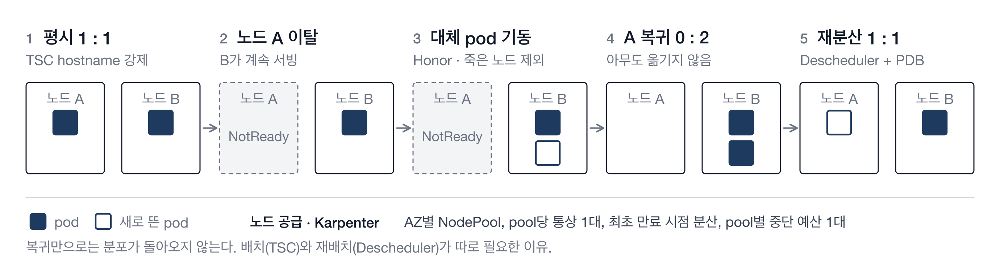
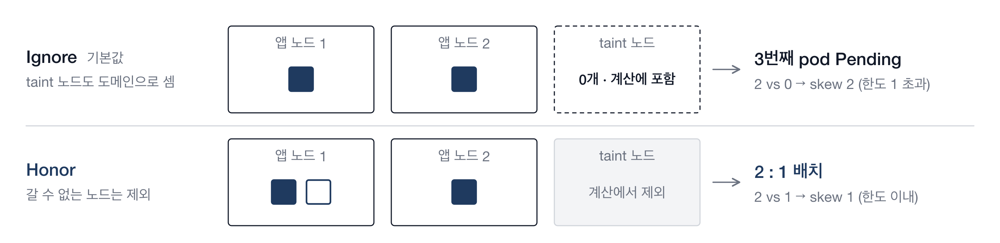
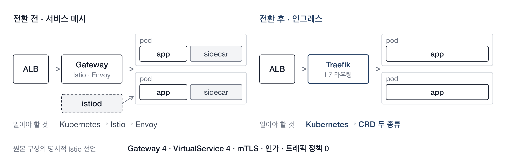
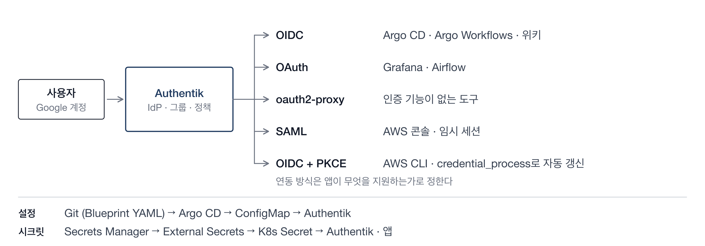
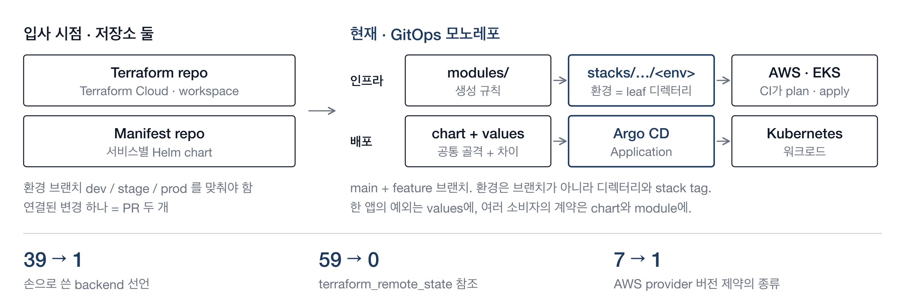
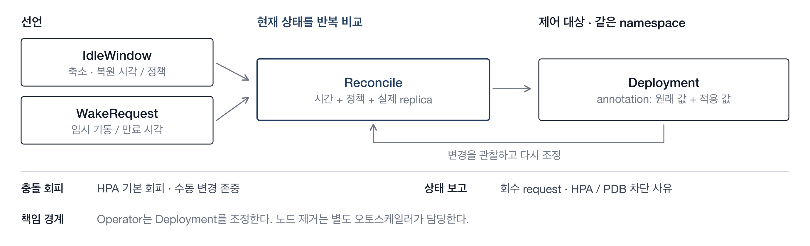

# 플랫폼 엔지니어링 포트폴리오

백종화 · DevOps Engineer · [b100hhss@gmail.com](mailto:b100hhss@gmail.com) · [github.com/b100to](https://github.com/b100to)

EKS 플랫폼의 복잡도와 장애를 줄인 운영 사례 네 건과, 운영 자동화를 직접 구현한 개인 프로젝트 한 건이다.

| | 작업 | 기간 | 요약 | 근거 |
|---|---|---|---|---|
| 1 | 워크로드 분산 | 2026.05 – 07 | 노드 한 대가 빠져도 서비스가 남도록 네 층으로 설계 | 강제 분산이 장애 중 복구를 막는 경우를 재현으로 확인 |
| 2 | Istio → Traefik | 2025.12 – 2026.01 | 서비스 메시를 걷어내고 20여 개 서비스를 무중단 전환 | 명시적 Istio 선언은 `Gateway` 4 · `VirtualService` 4뿐 |
| 3 | Authentik SSO | 2026 | 계정 하나로 운영 도구와 AWS까지. IdP 설정도 Git으로 | 앱 20 · provider 10 · 정책 바인딩 15를 YAML로 선언 |
| 4 | GitOps 재설계 | 2024.03 – 2026.03 | 저장소 둘과 Terraform Cloud를 모노레포 하나로 | backend 선언 39 → 생성 규칙 1 |
| 5 | idle-reaper | 2026.08 – 09 | 개인 프로젝트: 유휴 시간의 축소·복원을 Kubernetes Operator로 구현 | 시간 판정 테스트·kind 배포, 제어 충돌을 피하는 설계 |

운영 사례의 수치는 비공개 원본 구성의 집계와 당시 검증 기록을 따른다. 네 사례의 공개 예제는 설계 패턴을 단순화한 것이며, 원본의 규모·운영 결과를 그대로 재현하지 않는다. idle-reaper는 실제 구현 코드를 공개한 개인 랩 프로젝트다.

**공개 설계 예제:** [platform-engineering-examples](https://github.com/b100to/platform-engineering-examples) - 네 사례의 대표 설정과 전후 비교.

**Operator 구현:** [idle-reaper](https://github.com/b100to/platform-lab/tree/main/operators/idle-reaper) - Go 기반 컨트롤러·CRD·Helm chart.

---

## 1. 워크로드 분산

2026.05 – 2026.07 · EKS, Karpenter, TopologySpreadConstraints, PDB, Descheduler

- **문제** — 간헐적 장애의 원인은 쏠림이었다. replica는 여러 개였지만 한 노드에 몰려 있어 노드 기준으로는 하나였다. 분산 제약은 없거나 권고였고, 한 번 몰리면 되돌릴 수단이 없었다.
- **판단** — 한 도구로 풀지 않았다. 배치(TSC), 재배치(Descheduler), 보호(PDB), 노드 공급(Karpenter)으로 나누고 각 도구가 못 하는 일을 다음 층이 받게 했다.
- **결과** — 운영 환경에서 단일 노드 이탈 시 워크로드가 다른 노드로 재배치되고 서비스가 유지되는 것을 확인했다.

**설계 예제:** [TSC·PDB](https://github.com/b100to/platform-engineering-examples/blob/main/availability/workload.yaml) · [Descheduler 정책](https://github.com/b100to/platform-engineering-examples/blob/main/availability/descheduler-values.yaml) · [AZ별 NodePool](https://github.com/b100to/platform-engineering-examples/blob/main/availability/nodepools.yaml)

**핵심 발견.** 분산을 강제하면서 `nodeTaintsPolicy`를 기본값으로 두면, 갈 수 없는 노드가 "0개짜리 도메인"으로 계산에 남는다. 죽은 노드도 마찬가지라서, 가용성을 위한 설정이 장애 중 복구를 막는다.

| kind 재현 (Kubernetes v1.35) | `Ignore` 기본값 | `Honor` |
|---|---|---|
| replica 3, 앱 노드 2대 + taint 노드 | 1개 Pending | 2 : 1 배치 |
| 노드가 빠진 동안 (replica 2) | 대체 pod Pending | 생존 노드에 Running |
| 노드 복귀 뒤 (replica 2) | 1 : 1 | 2 : 0 그대로 |

- **한계** — Descheduler의 evict 동작은 로컬에서 재현하지 않았다. `Honor`는 장애 중 pod을 생존 노드에 모으므로 그 노드의 requests 여유가 전제다.

[상세 설계](eks-workload-availability.md) · [재현 스크립트](../scripts/topology-spread-repro.sh)

---

## 2. Istio → Traefik

2025.12 – 2026.01 · Istio, Traefik, AWS Load Balancer Controller, Route53

- **문제** — 개발자는 요청이 어디서 막혔는지 찾기 어려웠고, 구조를 이해하려면 Istio부터 알아야 했다. 엔지니어는 sidecar와 Istio 설정, 결국 Envoy까지 내려가야 했다. 인수인계도 어려웠다.
- **판단** — 실제로 쓰는 것을 셌다. 명시적으로 선언된 것은 인그레스 라우팅뿐이었고, 서비스는 20여 개에 MSA 경계도 뚜렷하지 않았다. 메시를 유지할 조건이 아니었다.
- **결과** — 20여 개 서비스를 무중단으로 전환하고 sidecar 주입과 Istio 제어면을 제거했다. 구조 설명이 "ALB → Traefik → 서비스" 한 줄이 되었다.

| 선택지 | 판단 |
|---|---|
| Istio 유지 | 학습·디버깅 부담과 pod당 오버헤드가 그대로 |
| ALB 단독 | 기능은 가능. 라우팅을 Kubernetes CRD로 관리하고 AWS 리소스 변경과 분리하려고 제외 |
| ingress-nginx | 사실상의 표준이지만 [retirement 공지](https://kubernetes.io/blog/2025/11/11/ingress-nginx-retirement/) 직후. 2026년 3월 이후 보안 패치 없음 |
| **Traefik** | 필요한 기능을 CRD 두 종류로 선언. 유지보수 활발 |

- **설계** — ALB·인증서 연결은 Load Balancer Controller가, DNS는 ExternalDNS가, host·path 라우팅은 Traefik이 소유한다. 연결점은 catch-all Ingress 하나라서 서비스가 늘어도 ALB 규칙은 하나다.
- **전환** — 새 ALB를 옛 ALB 옆에 세우고 DNS 가중치만 90:10 → 50:50 → 0:100으로 옮겼다. 롤백은 같은 숫자를 되돌리는 것이다.
- **한계** — 스냅샷은 일부 서비스만 담고 있고, 선언이 없어도 auto mTLS는 동작했을 수 있다. 서비스 간 mTLS 요구가 생기면 별도 설계가 필요하다. 실측 리소스 절감치는 없다.

[상세 설계·전환 절차](istio-to-traefik.md)

**전후 예제:** [VirtualService](https://github.com/b100to/platform-engineering-examples/blob/main/routing/before/virtualservice.yaml) → [IngressRoute](https://github.com/b100to/platform-engineering-examples/blob/main/routing/after/ingressroute.yaml) · [ALB 연결](https://github.com/b100to/platform-engineering-examples/blob/main/routing/after/alb-ingress.yaml) · [DNS 전환 절차](https://github.com/b100to/platform-engineering-examples/blob/main/routing/dns-weights.md)

---

## 3. Authentik SSO

2026 · Authentik, OIDC, SAML, External Secrets, Argo CD

- **문제** — 도구마다 계정이 따로 있어 온보딩과 오프보딩이 수작업이었다. 인증이 없는 도구는 IP 제한에만 의존했고, AWS는 사람 수만큼 장기 자격 증명이 있었다.
- **판단** — IdP 선택 기준은 "설정을 Git에서 리뷰할 수 있는가"였다. Authentik의 Blueprint(YAML)가 기존 GitOps 방식에 가장 직접적으로 맞았다. 연동 방식은 앱이 지원하는 만큼만 골랐다.
- **결과** — 온보딩은 Google 로그인과 그룹 추가 한 번. AWS 콘솔은 SAML, CLI는 OIDC + `credential_process`로 바꿔 사람에게 발급된 장기 자격 증명을 없앴다.

- **설정과 시크릿의 분리** — Blueprint에는 `!Env` 참조만 둔다. IdP와 앱이 Secrets Manager의 같은 값을 읽어 수동 복사로 인한 불일치를 줄였다.
- **운영에서 배운 것** — Argo CD는 `Synced · Healthy`였지만 IdP 내부에서 Blueprint 하나가 약 6개월간 error 상태였다. "선언 = 현실"은 선언을 읽는 쪽이 성공을 보고할 때만 성립한다. 이후 Blueprint 상태 조회를 검증 절차에 넣었다.
- **한계** — Blueprint 실패의 자동 감시는 아직 과제다. 퇴사 처리는 신규 인증 차단까지가 중앙화된 범위이고, 기존 세션과 임시 자격 증명은 만료를 따로 확인한다.

[상세 설계·겪은 함정](sso-authentik.md)

**설계 예제:** [Blueprint 선언](https://github.com/b100to/platform-engineering-examples/blob/main/sso/blueprint.yaml) · [시크릿 연동](https://github.com/b100to/platform-engineering-examples/blob/main/sso/external-secret.yaml) · [ID token → STS 연결](https://github.com/b100to/platform-engineering-examples/blob/main/sso/credential-process.py). PKCE 로그인·갱신은 예제 범위 밖이다.

---

## 4. GitOps 재설계

2024.03 – 2026.03 · Terraform, Terramate, Argo CD, Helm, GitHub Actions

- **문제** — Terraform 저장소와 manifest 저장소가 따로 있었다. Terraform Cloud는 비용이 추가됐고, 환경 브랜치 셋을 맞춰야 했으며, 환경이 workspace 이름 안에 숨어 코드만으로는 적용 대상을 알기 어려웠다.
- **판단** — 인프라와 배포는 이름으로 이어져 있어, 저장소가 나뉘면 그 연결이 PR 두 개가 된다. 분리의 이점은 규모가 클 때 나온다. 하나로 합치고, 반복은 Terramate 생성 규칙으로 없앴다. 생성 결과가 native `.tf`라 새로 온 사람도 최종 코드를 직접 읽는다.
- **결과** — 손으로 쓴 backend 선언 39개가 생성 규칙 1개(S3 backend stack 69개)로, `terraform_remote_state` 참조 59곳이 0으로 줄었다. CI 자격 증명은 IAM user key에서 GitHub OIDC로 바꿨다.

| 공개 예제 | 비교할 내용 |
|---|---|
| [이전 인프라](https://github.com/b100to/platform-engineering-examples/tree/main/gitops/before/terraform) | Terraform Cloud workspace 기반 backend |
| [이전 배포](https://github.com/b100to/platform-engineering-examples/tree/main/gitops/before/helm/app) | 서비스별 chart에 배포 구조를 정의 |
| [개편 후](https://github.com/b100to/platform-engineering-examples/tree/main/gitops/after) | [S3 backend 생성 규칙](https://github.com/b100to/platform-engineering-examples/blob/main/gitops/after/terramate/imports/backend.tm.hcl)과 공통 chart로 반복 분리 |

**Helm 공통화 예제:** [공통 chart](https://github.com/b100to/platform-engineering-examples/tree/main/gitops/after/helm/app) + [환경 values](https://github.com/b100to/platform-engineering-examples/blob/main/gitops/after/values/dev.yaml) → [Argo CD Application](https://github.com/b100to/platform-engineering-examples/blob/main/gitops/after/argocd/application.yaml).

- **한계** — 공통 chart나 module의 작은 변경이 여러 소비자에게 전파된다. 권한은 아직 경로별로 나누지 않았다.

[상세 설계](devops-configs-architecture.md)

---

## 5. idle-reaper Operator

2026.08 – 2026.09 · 개인 프로젝트 · Go, Kubebuilder, controller-runtime, Helm, kind

- **문제** — 개발 환경을 밤에 줄이는 것보다, 원래 규모로 복원하고 야간 작업자의 수동 변경을 덮어쓰지 않는 것이 어려웠다. 예약 실행만으로는 놓친 시각과 제어 충돌을 설명하기 부족했다.
- **판단** — 시간 이벤트를 한 번 실행하는 대신 현재 시각·정책·Deployment를 반복 비교하는 Controller를 만들었다. 워크로드 축소는 직접 제어하고, 노드 제거는 노드 오토스케일러의 책임으로 남겼다.
- **구현** — `IdleWindow`로 축소·복원 정책을 선언하고 `WakeRequest`로 임시 기동을 요청한다. 회수 request량과 HPA·수동 변경·PDB 차단 요인을 status·Event·Prometheus 지표로 드러낸다.

| 설계 선택 | 이유와 대가 |
|---|---|
| Deployment annotation에 원래 replica 저장 | 정책 CR과 별개로 복원 기준을 보존. annotation이 유실되면 원래 값을 복원할 수 없다. |
| HPA 기본 회피·수동 변경 존중 | 다른 제어자와 replica를 다투지 않는다. GitOps 변경과 사람의 변경은 구분하지 못한다. |
| 정책과 임시 기동 요청을 CR로 분리 | RBAC으로 요청 권한을 따로 부여 가능. 상한 초과 요청은 Controller가 거부 상태로 기록한다. |

- **검증** — 시간 경계 7개와 기상 시각을 놓친 재시작 시각 1개의 판정 테스트 통과. 로컬 kind에서 Controller 배포 `1/1`을 확인했다. 축소·복원·요청 만료의 전체 흐름 자동 검증은 보강 과제다.
- **한계** — Deployment만 지원한다. 빈 노드 후보는 관측값이며 실제 노드 제거·Karpenter 연동·비용 절감은 검증하지 않았다.

[상세 설계](../operators/idle-reaper/DESIGN.md) · [제어 루프](../operators/idle-reaper/internal/controller/idlewindow_controller.go) · [시간 판정 테스트](../operators/idle-reaper/internal/controller/window_test.go)
