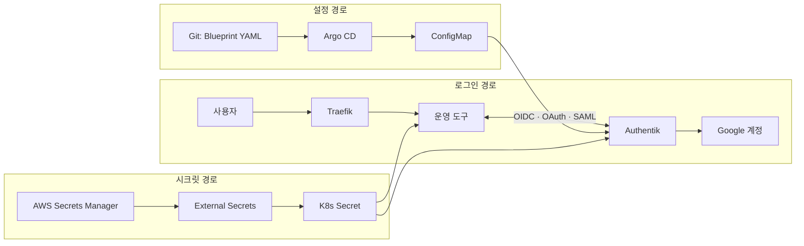

# 계정 하나로 클러스터 도구와 AWS까지: Authentik SSO 설계

Kubernetes 위의 운영 도구와 AWS 접근을 하나의 IdP로 묶고, 그 IdP의 설정까지 Git으로 관리하게 만든 과정을 설명한다. 도구마다 지원하는 인증 방식이 달라서, 핵심은 "SSO를 붙였다"가 아니라 **붙이는 방식을 앱의 능력에 맞춰 고른 것**과 **IdP 설정을 코드로 둔 것**이다.

| 근거 | 대상 | 기준 |
|---|---|---|
| 설정 | [`devops-configs-portfolio`](https://github.com/b100to/devops-configs-portfolio) | commit [`7e3427a`](https://github.com/b100to/devops-configs-portfolio/tree/7e3427a3a422f103cc6e4bc12adf79147ddacbec) 정적 스냅샷 |

스냅샷의 설정을 읽은 문서이며, 운영 클러스터의 현재 상태를 증명하지는 않는다. 저장소 구조는 [GitOps 저장소 아키텍처와 공통화 설계](devops-configs-architecture.md)에서 다룬다.

## 1. 문제: 도구 수만큼 계정이 있었다

| 증상 | 결과 |
|---|---|
| Argo CD, Grafana, Airflow, Argo Workflows가 각자 계정을 가짐 | 입사자 한 명에 계정 생성 여러 번, 퇴사자 한 명에 삭제 여러 번. 하나라도 빠뜨리면 남는 계정이 생김 |
| 인증 기능이 아예 없는 도구가 있음 | IP 제한에만 의존 |
| AWS 콘솔은 IAM User, CLI는 access key | 만료되지 않는 자격 증명이 사람 수만큼 존재 |

목표는 둘이었다. 회사 Google 계정 하나로 전부 로그인할 것, 그리고 장기 자격 증명을 없앨 것.

## 2. IdP 선택: 설정을 Git에 둘 수 있는가

| 관점 | SaaS IdP | Keycloak | Authentik |
|---|---|---|---|
| 형태 | SaaS | self-hosted | self-hosted |
| 과금 | 사용자당 | 없음 | 없음 |
| 설정 방식 | UI 중심 | UI와 export 파일 | **Blueprint (YAML)** |

결정적인 기준은 마지막 행이다. 이 저장소는 인프라와 배포를 전부 Git에서 선언한다. IdP만 UI에서 클릭으로 관리하면, 가장 민감한 설정이 유일하게 리뷰도 이력도 없는 영역이 된다. Authentik의 Blueprint는 애플리케이션, provider, 정책, 그룹을 YAML로 선언하고 서버가 그것을 읽어 적용한다.

사용자당 과금은 팀이 커질수록 비용이 따라 커지는 구조라 먼저 제외했다.

## 3. 구조: 세 개의 경로



| 경로 | 흐르는 것 | 저장소 위치 |
|---|---|---|
| 로그인 | 사용자의 인증 요청 | [`manifests/traefik/prd/infra.yaml`](https://github.com/b100to/devops-configs-portfolio/blob/7e3427a3a422f103cc6e4bc12adf79147ddacbec/manifests/traefik/prd/infra.yaml) |
| 설정 | 앱·provider·정책·그룹 선언 | [`manifests/authentik/prd/blueprints.yaml`](https://github.com/b100to/devops-configs-portfolio/blob/7e3427a3a422f103cc6e4bc12adf79147ddacbec/manifests/authentik/prd/blueprints.yaml) |
| 시크릿 | OAuth client secret | [`manifests/authentik/prd/external-secret.yaml`](https://github.com/b100to/devops-configs-portfolio/blob/7e3427a3a422f103cc6e4bc12adf79147ddacbec/manifests/authentik/prd/external-secret.yaml) |

설정은 Git에 있지만 시크릿은 Git에 없다. 이 둘을 잇는 방법이 4절이다.

## 4. IdP 설정을 코드로: Blueprint

Blueprint들은 ConfigMap 하나에 담겨 Authentik pod에 마운트된다. [`authentik prd values`](https://github.com/b100to/devops-configs-portfolio/blob/7e3427a3a422f103cc6e4bc12adf79147ddacbec/values/infra/authentik/prd.yaml)가 그 ConfigMap을 지정하고, [`Argo CD Application`](https://github.com/b100to/devops-configs-portfolio/blob/7e3427a3a422f103cc6e4bc12adf79147ddacbec/argocd/prd/infra/security/authentik.yaml)이 동기화한다.

스냅샷 기준 규모:

| 항목 | 수 |
|---|---|
| Blueprint 인스턴스 | 19 |
| Application | 20 |
| OAuth2 provider / SAML provider | 8 / 2 |
| 정책 바인딩 | 15 |

### 시크릿을 Git 밖에 두는 방법

Blueprint에는 client secret 자리에 환경 변수 참조만 적는다.

```yaml
# blueprints.yaml — Git 에 있는 것
- model: authentik_providers_oauth2.oauth2provider
  attrs:
    client_id: grafana
    client_secret: !Env AUTHENTIK_GRAFANA_OAUTH_SECRET
```

```yaml
# external-secret.yaml — 값은 AWS Secrets Manager 에서
- secretKey: AUTHENTIK_GRAFANA_OAUTH_SECRET
  remoteRef: { key: <cluster-secret>, property: <property> }
```

ExternalSecret이 만든 K8s Secret을 Authentik pod이 `envFrom`으로 받고, Blueprint의 `!Env`가 그 값을 읽는다. 앱 쪽 [`ExternalSecret`](https://github.com/b100to/devops-configs-portfolio/blob/7e3427a3a422f103cc6e4bc12adf79147ddacbec/manifests/external-secrets/prd/es-kubecost-oauth2.yaml)도 Secrets Manager의 **같은 property**를 읽으므로, IdP가 아는 secret과 앱이 보내는 secret이 어긋날 수 없다. 스냅샷에서 Blueprint의 `!Env` 변수 7개가 전부 ExternalSecret 키에 대응하는 것을 확인했다.

### 접근 모델도 선언이다

| 단계 | 선언된 동작 |
|---|---|
| Google 계정으로 최초 로그인 | 제한 그룹에 자동 배정. 사내 위키만 보임 |
| 개발자로 승격 | 관리자가 개발 그룹에 추가 (수동, 한 번) |
| 개발 도구 접근 | 앱마다 "개발 그룹만 허용" expression policy를 바인딩 |
| 퇴사 | Authentik 계정 하나를 비활성화 |

"처음 들어온 사람은 아무것도 못 본다"가 기본값이라는 점이 중요하다. 권한은 기본으로 열려 있다가 닫는 것이 아니라 닫혀 있다가 여는 것이다.

## 5. 앱 연동: 앱이 지원하는 만큼만

연동 방식은 선호가 아니라 **앱이 무엇을 지원하는가**로 정해진다.

| 앱의 능력 | 방식 | 대상 |
|---|---|---|
| OIDC 내장 | OIDC | Argo CD, Argo Workflows, 위키 |
| OAuth는 되지만 discovery 미사용 | Generic OAuth — `auth_url`·`token_url`·`api_url`을 직접 지정 | Grafana ([`values`](https://github.com/b100to/devops-configs-portfolio/blob/7e3427a3a422f103cc6e4bc12adf79147ddacbec/values/infra/monitoring/grafana/prd.yaml)) |
| 프레임워크 수준의 OAuth | Flask OAuth | Airflow |
| 인증 기능 없음 | 앞단에 oauth2-proxy를 reverse proxy로 배치 | 비용 분석 도구 |
| SAML SP | SAML | AWS 콘솔 |
| CLI | OIDC Authorization Code + PKCE | AWS CLI (6절) |

### 5-1. Argo CD: public client 하나로 웹과 CLI를 통합

Authentik은 **application마다 issuer가 다르다.** CLI용 provider를 따로 만들면 issuer가 `/application/o/argocd-cli/`가 되어, 서버가 기대하는 `/application/o/argocd/`와 어긋나 토큰 검증이 실패한다.

| 시도 | 결과 |
|---|---|
| 웹은 confidential, CLI는 별도 public provider | issuer 불일치로 CLI 로그인 실패 |
| provider 하나를 public으로 두고 웹과 CLI가 공유 | 동작. CLI용 `http://localhost:.*/auth/callback` redirect URI만 추가 |

public client는 secret이 없지만 PKCE가 그 자리를 채운다. 로그인 시작 시 만든 일회성 값이 없으면 authorization code를 가로채도 토큰으로 바꿀 수 없다. CLI는 어차피 secret을 안전하게 보관할 수 없으므로, secret이 있는 척하는 것보다 정확한 모델이다.

### 5-2. 인증이 없는 도구: oauth2-proxy

```text
사용자 → Traefik → oauth2-proxy ↔ Authentik
                        │ 인증된 요청만
                        ▼
                   비용 분석 도구
```

[`IngressRoute`](https://github.com/b100to/devops-configs-portfolio/blob/7e3427a3a422f103cc6e4bc12adf79147ddacbec/manifests/traefik/prd/infra.yaml)는 해당 호스트의 모든 트래픽을 proxy로 보낸다. 도구 자체에는 인증 설정이 없다.

여기서 밟은 함정: cookie secret을 컨테이너 `args`의 `$(VAR)` 치환으로 넘기면 재배포 때 cookie signature가 맞지 않았다. 치환 동작이 런타임에 따라 달랐기 때문이다. `OAUTH2_PROXY_COOKIE_SECRET` 같은 네이티브 환경 변수로 넘기는 것으로 통일했다.

### 5-3. Argo Workflows: 무한 리다이렉트

Argo Workflows는 미인증 사용자를 스스로 SSO로 보내지 않는다. 그래서 Traefik middleware로 `/` 접근을 SSO로 리다이렉트했는데, 로그인을 마치고 돌아온 요청도 다시 `/`라서 끝없이 돌았다.

```text
/ → SSO → 로그인 완료 → / → SSO → ...
```

Traefik은 로그인이 끝났는지 알 방법이 없다. 하지만 로그인 뒤에는 `authorization` 쿠키가 생긴다. 그래서 **쿠키 유무로 라우트를 나눴다.**

```yaml
routes:
  - match: Host(`...`) && HeaderRegexp(`Cookie`, `authorization=`)   # 인증됨 → 그대로 전달
    priority: 20
  - match: Host(`...`) && Path(`/`)                                  # 미인증의 첫 진입 → SSO
    priority: 15
    middlewares: [argo-sso-redirect]
  - match: Host(`...`)                                               # 콜백·정적 파일 → 그대로 전달
    priority: 10
```

쿠키는 HttpOnly라 스크립트로 위조해 우회할 수 없고, 쿠키가 있어도 실제 권한 검증은 Argo Workflows가 한다. Traefik 라우트는 "어디로 보낼까"만 정한다.

이 문제를 오래 끈 원인은 따로 있었다. Traefik v3에서 matcher 이름이 `HeadersRegexp`에서 `HeaderRegexp`로 바뀌었는데, v2 이름을 쓰면 **에러 없이 규칙이 무시된다.** 로그에 아무것도 남지 않아 설계가 틀렸다고 오해한 채 시간을 썼다.

### 5-4. IdP 자체의 라우팅: 호출자가 누구인가

IdP 호스트에 IP 제한을 통째로 걸면 OIDC가 깨진다. 같은 호스트를 서로 다른 세 주체가 호출하기 때문이다.

| 경로 | 호출자 | IP 제한 |
|---|---|---|
| 로그인 UI, `authorize` | 사용자 브라우저 | 적용 |
| `token`, `userinfo`, `jwks`, discovery | 앱 pod (서버 간 호출) | 미적용. 출발지가 사용자 IP가 아님 |
| AWS CLI용 provider의 `jwks`, discovery | AWS STS | 미적용. AWS가 토큰 서명을 검증하러 옴 |

IngressRoute 하나 안에서 경로와 priority로 나눈다. 사람이 쓰는 화면은 막고, 기계가 서명을 확인하는 공개 endpoint만 연다.

## 6. AWS 접근: 장기 자격 증명을 없애기

| 대상 | 이전 | 현재 |
|---|---|---|
| 콘솔 | IAM User + 비밀번호 | Authentik이 SAML IdP, IAM이 SP. 세션은 임시 자격 증명 |
| CLI | access key | OIDC + PKCE → `AssumeRoleWithWebIdentity` → 임시 자격 증명 |

### CLI: `credential_process`로 투명하게

```text
aws CLI ──credential_process──▶ aws-oidc.sh
                                   │ 1. STS 캐시 유효?          → 즉시 반환
                                   │ 2. id_token 유효?          → STS 재발급
                                   │ 3. refresh_token 유효?     → id_token 갱신
                                   │ 4. 전부 만료               → 브라우저 로그인
                                   ▼
                              Authentik ──id_token──▶ AWS STS ──▶ 임시 자격 증명 (1h)
```

[`aws-oidc.sh`](https://github.com/b100to/devops-configs-portfolio/blob/7e3427a3a422f103cc6e4bc12adf79147ddacbec/scripts/aws-oidc.sh)는 AWS CLI가 자격 증명이 필요할 때 호출하는 프로그램이다. 사용자는 하루에 한 번 브라우저 로그인을 하고, 그 뒤 12시간은 refresh token이 조용히 갱신한다. `aws`를 호출하는 다른 도구와 에이전트도 같은 프로필을 그대로 쓴다.

콘솔용 SAML과 CLI용 OIDC를 나눈 이유는 갱신 방식이다. SAML은 매번 브라우저를 거쳐야 하지만 OIDC는 refresh token이 있다. 하루에 수백 번 호출되는 CLI에는 후자가 맞다.

### IAM 쪽 신뢰 조건

[`authentik-aws-oidc` 모듈](https://github.com/b100to/devops-configs-portfolio/blob/7e3427a3a422f103cc6e4bc12adf79147ddacbec/modules/iam/authentik-aws-oidc/main.tm.hcl)의 관련 필드 발췌:

```hcl
Action    = "sts:AssumeRoleWithWebIdentity"
Principal = { Federated = aws_iam_openid_connect_provider.authentik.arn }
Condition = {
  StringEquals = { "<idp-host>:aud" = var.oidc_client_ids[0] }   # 이 client 가 발급한 토큰만
  StringLike   = { "<idp-host>:sub" = var.allowed_sub_pattern }  # 회사 도메인 계정만
  # allowed_source_ips 가 있으면 IpAddress 조건 추가
}
```

`sub`를 조건으로 쓰기 위해 provider의 `sub_mode`를 이메일로 두었다. IAM OIDC 신뢰 정책이 조건으로 쓸 수 있는 claim은 제한적이라, 토큰의 어느 필드에 무엇을 담을지는 IdP 쪽 설정과 함께 정해야 한다. IAM OIDC provider와 role은 Terraform이, Authentik 쪽 provider는 Blueprint가 선언한다. 양쪽이 한 저장소에 있어서 client ID 같은 연결 값을 한 PR에서 맞출 수 있다.

## 7. 겪은 함정 모음

| 증상 | 원인 | 해결 |
|---|---|---|
| Argo CD CLI 로그인 시 토큰 검증 실패 | application별 issuer. CLI용 별도 provider는 issuer가 다름 | provider 하나를 public + PKCE로 공유 (5-1) |
| Argo Workflows 무한 리다이렉트 | Traefik이 로그인 완료를 알 수 없음 | 쿠키 유무로 라우트 분기 (5-3) |
| 위 분기가 작동하지 않음, 로그 없음 | Traefik v3의 `HeaderRegexp`. v2 이름은 조용히 무시됨 | matcher 이름 수정 |
| Argo Workflows `code:7 "not allowed"` | Kubernetes 1.24부터 ServiceAccount token Secret이 자동 생성되지 않음 | `kubernetes.io/service-account-token` Secret을 직접 선언 |
| oauth2-proxy 재배포 뒤 로그인 루프 | `args`의 `$(VAR)` 치환 차이로 cookie signature 불일치 | 네이티브 환경 변수로 전달 (5-2) |
| oauth2-proxy `--cookie-refresh` 사용 시 루프 | `offline_access` scope가 없어 refresh token 미발급 | scope 추가 |
| IdP가 산발적으로 503 | server CPU limit이 낮아 throttle → readiness 실패 → 재시작 반복 | CPU limit 상향, replica 2 + 노드 분산 ([분산 설계](eks-workload-availability.md)) |

마지막 행은 SSO의 성격을 보여준다. 모든 도구의 로그인이 IdP 하나에 걸리므로, IdP의 가용성이 곧 전체 도구의 가용성이다.

## 8. 한계: Synced가 "적용됨"은 아니다

Blueprint 방식의 가장 큰 함정은 운영 중에 발견했다.

| 관찰 | 의미 |
|---|---|
| Argo CD는 `Synced` + `Healthy` | ConfigMap이 클러스터에 있다는 뜻일 뿐 |
| Authentik 내부의 Blueprint 상태는 `error` | 서버가 그 YAML을 적용하다 실패 |
| 실패해도 알림이 없음 | 한 Blueprint가 **약 6개월간** 적용되지 않은 채 아무도 몰랐음 |

원인은 URL을 검증하는 필드에 URL이 아닌 값을 넣은 한 줄이었다. Blueprint는 파일 단위로 전부 아니면 전무라서, 그 한 줄 때문에 같은 파일의 다른 변경도 함께 적용되지 않았다. Git에는 의도가 있고 리뷰도 통과했지만 실제 시스템은 그 이전 상태였다.

여기서 확인한 Blueprint의 성질:

| 성질 | 결과 |
|---|---|
| 파일 단위 원자성 | 항목 하나의 검증 실패가 파일 전체를 막음 |
| 내용 해시가 바뀔 때만 재적용 | **주석 한 줄**을 고쳐도 재적용되고, 그동안 쌓인 불일치가 그때 터짐 |
| 파일명 알파벳순 실행 | 다른 Blueprint의 객체를 참조하면 순서에 따라 실패. 같은 파일 안에서 만들고 참조하는 쪽이 안전 |
| 선언에서 지운 객체는 DB에 남음 | 삭제는 `state: absent`로 명시해야 함 |

GitOps의 "선언 = 현실"은 **선언을 읽는 쪽이 성공을 보고할 때만** 성립한다. Argo CD는 Kubernetes 리소스까지만 보고, 그 리소스를 읽는 애플리케이션 내부는 보지 못한다. 그래서 Blueprint 상태를 직접 조회하는 점검을 검증 절차에 넣었다. 자동 감시는 아직 과제다.

그 밖에 코드로 옮기지 못한 것:

| 항목 | 이유 |
|---|---|
| 로그인 화면에 Google source 연결 | Blueprint의 `!Find`를 list 안에서 쓸 수 없음 |
| 사용자의 그룹 배정 | 사람에 대한 판단이라 의도적으로 수동 |

## 9. 결과

| 항목 | 이전 | 현재 |
|---|---|---|
| 입사자 온보딩 | 도구마다 계정 생성 | Google 계정 로그인 + 그룹 추가 한 번 |
| 퇴사자 처리 | 도구마다 계정 삭제 | IdP 계정 비활성화 한 번 |
| 인증 없는 도구 | IP 제한만 | proxy 뒤에서 SSO |
| AWS 콘솔 | IAM User (장기) | SAML (임시) |
| AWS CLI | access key (장기) | OIDC + `credential_process` (임시, 자동 갱신) |
| 새 도구 추가 | 계정 체계를 새로 설계 | Blueprint에 application 항목 추가 |

가장 큰 변화는 편의가 아니라 **사람에게 발급된 장기 자격 증명이 없어진 것**이다.
